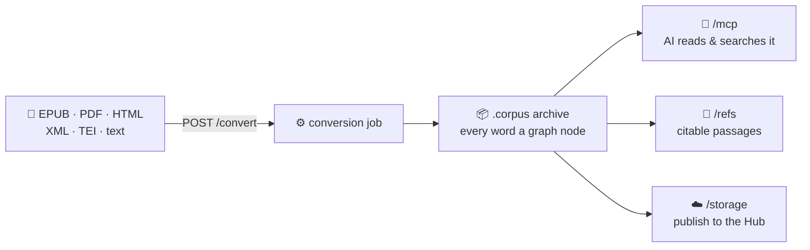

<div align="center">

# corpora-py

[](https://github.com/exegia/corpora-py/actions/workflows/pr.yml)
[](https://pypi.org/project/corpora-py/)
[](https://pypi.org/project/corpora-py/)
[](LICENSE)

**📚 Turn any book into a queryable text graph — then let an AI read it with you.**


</div>

---

## Install

```bash
pip install corpora-py          # or: uv add corpora-py
```

```bash
AUTH_REQUIRED=false corpora-api    # http://127.0.0.1:8000 — leave it running
```

The examples below run in a **second shell** and pipe through
[`jq`](https://jqlang.github.io/jq/) (`brew install jq`).

Auth is **on** by default and fails closed (401 without a Supabase JWT).
`AUTH_REQUIRED=false` is for local use — see [Settings](#settings).

---

## What you get



---

## Use it

### 1. Convert a document

```bash
curl -sF file=@book.epub -F source_format=epub -F name='My Book' \
  localhost:8000/convert | tee job.json
# → {"job_id": "1ec2121b-…", "status_url": "/convert/1ec2121b-…", "ws_url": "…/ws"}

JOB=$(jq -r .job_id job.json)      # every command below uses it
```

`source_format`: `epub` · `pdf` · `html` · `xml` · `tei` · `tei_zip` · `plain` · `tf_zip`

### 2. Watch it, then take the archive

```bash
curl -s localhost:8000/convert/$JOB          # {"status": "succeeded", …}
curl -sOJ localhost:8000/convert/$JOB/download
```

Long jobs push the same status over a WebSocket: `ws://…/convert/$JOB/ws`.

### 3. Read it back before publishing

```bash
curl -s localhost:8000/convert/$JOB/sections            # the table of contents
curl -s "localhost:8000/convert/$JOB/content?limit=1"   # passages + tokens
curl -s localhost:8000/convert/$JOB/manifest            # title, authors, version
```

### 4. Let Claude read it

Add to `claude_desktop_config.json`:

```json
{
  "mcpServers": {
    "corpora": {
      "command": "cf-mcp",
      "args": ["--corpus", "/Users/you/.exegia/datasets/BHSA", "--name", "BHSA"]
    }
  }
}
```

Then ask it things. A good tool order for an agent:

```
describe_corpus() → list_features() → search(…, "count") → search(…, "results") → get_passages(…)
```

### 5. Cite a passage

```bash
curl "localhost:8000/refs/resolve?ref=bhsa@2021/Deut:4:2!clause1"
```

One grammar for every corpus — `corpus@version/Section:Section!typeN`:

| Reference | Means |
|---|---|
| `bhsa@2021/Deut:4:2` | Deuteronomy 4:2 |
| `bhsa/Deut:4:2!clause1` | its 1st clause |
| `mobydick@1.0/Moby-Dick:3!word12` | 12th word of chapter 3 |

`POST /refs` turns a node into one. Full grammar: [`skills/tf-reference-id`](skills/tf-reference-id).

### 6. Publish and browse a library

```bash
curl -sX POST localhost:8000/storage \
  -H 'content-type: application/json' -d "{\"job_id\": \"$JOB\"}"   # publish
curl -s localhost:8000/storage                          # what's published
curl -s localhost:8000/storage/my-book.corpus/content   # read it
```

Needs `HF_STORAGE_REPO` + `HF_TOKEN`.

---

## Endpoints

| Path | What it does |
|---|---|
| `/mcp` | MCP server — **30 tools** (26 read-only, 15 in a standalone `cf-mcp`) |
| `/convert` | Upload → job → `.corpus`; read, annotate and version the result |
| `/storage` | Publish, list, read and edit archives on the Hub |
| `/refs` | Reference ⇄ node, plus labels, pills and share URLs |
| `/validate` | Confirm a dataset round-trips `.tf → .cfm → mmap` |
| `/ingest` | Docling → Context Fabric v1 `graph.json` (extra: `corpora-py[docling]`) |
| `/ai` | ⏳ stub — every route answers `501` ([#214](https://github.com/exegia/corpora-py/issues/214)) |
| `/health` · `/capabilities` | Liveness, and what this deployment permits |

Interactive docs while the server runs: **http://127.0.0.1:8000/docs**

<details>
<summary><b>All 30 MCP tools</b></summary>

| Group | Tools | In `cf-mcp` |
|---|---|:---:|
| Discovery | `list_corpora` `describe_corpus` `list_features` `describe_feature` `get_text_formats` | ✅ |
| Search | `search` `search_continue` `search_csv` `search_syntax_guide` | ✅ |
| Read | `get_passages` `get_node_features` | ✅ |
| Validate | `validate_corpus` | ✅ |
| References | `reference_create` `reference_resolve` `reference_shortcode` | ✅ |
| Hub storage | `storage_list_corpora` `storage_corpus_info` `storage_download_corpus` `storage_upload_corpus`\* `storage_delete_corpus`\* | — |
| Corpus detail | `corpus_sections` `corpus_index` `corpus_content` `corpus_node_get` `corpus_manifest_get` `corpus_manifest_update`\* `corpus_node_annotate`\* | — |
| Corpus refs | `corpus_reference_create` `corpus_reference_resolve` `corpus_reference_shortcode` | — |

\* Write tools — not registered at all when `HF_READ_ONLY=true`.

</details>

---

## Settings

| Variable | Default | Purpose |
|---|---|---|
| `AUTH_REQUIRED` | `true` | Require a Supabase JWT everywhere but `/health`, `/capabilities`, `/`, docs |
| `PROJECT_REF` | — | Supabase project whose JWKS verifies those tokens |
| `HF_STORAGE_REPO` · `HF_TOKEN` | — | The Hub repo behind `/storage` |
| `HF_READ_ONLY` | `false` | Refuse every Hub write — 403 on REST, write tools unregistered |
| `JOB_STORE` | `memory` | `supabase` shares job state across instances |

Public demo = `AUTH_REQUIRED=false` **and** `HF_READ_ONLY=true`. Set both, or
anonymous visitors can write to your Hub.

---

## Python instead of HTTP

```python
from admin.converters import CONVERTERS, convert_to_corpus
from admin.parsers import SourceFormat

tf_dir = CONVERTERS[SourceFormat.EPUB]("book.epub", "out/book.tf")
convert_to_corpus(tf_dir, "book.corpus", name="My Book", language_code="en")
```

```python
from corpora_mcp.corpus import corpus_manager

name = corpus_manager.load("~/.exegia/datasets/BHSA", name="BHSA")
api = corpus_manager.get_api(name)          # Text-Fabric api: api.F, api.T, api.S
```

`pip install corpora-py` ships all of it — `corpora_mcp`, `admin` and `common`
are bundled in that one wheel; there is no separate `corpora-mcp` on PyPI.

---

## Docker

```bash
make docker-build-corpora        # or: docker build -f dockerfiles/Dockerfile -t corpora-py .
docker run -p 8000:8000 -v ~/.exegia/datasets:/data/datasets:ro corpora-py
```

Images are also published to `ghcr.io/exegia/corpora-py` (login required).
MCP-only image: `dockerfiles/Dockerfile.client` · Compose:
`docker compose -f dockerfiles/docker-compose.yml up corpora`

---

## More

| | |
|---|---|
| 🖥️ **Desktop / web app** | [`example/`](example/README.md) — [live demo](https://corpora-py-example.vercel.app) |
| ⌨️ **Terminal CLI** | [`exegia/corpora-cli`](https://github.com/exegia/corpora-cli) — `brew tap exegia/corpora-cli https://github.com/exegia/corpora-cli && brew install corpora` |
| 🔧 **Conversion internals** | [`packages/admin/README.md`](packages/admin/README.md) |
| 📐 **Data model spec** | [Context Fabric v1](docs/architecture/context-fabric/README.md) |
| 🛠️ **Contributing / dev setup** | [`CLAUDE.md`](CLAUDE.md) · `make help` · [`.github/WORKFLOW.md`](.github/WORKFLOW.md) |

## License

[MIT](LICENSE)
