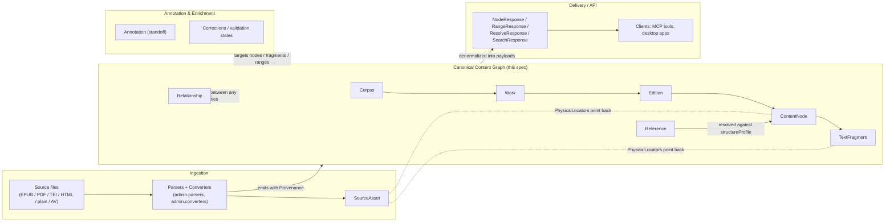
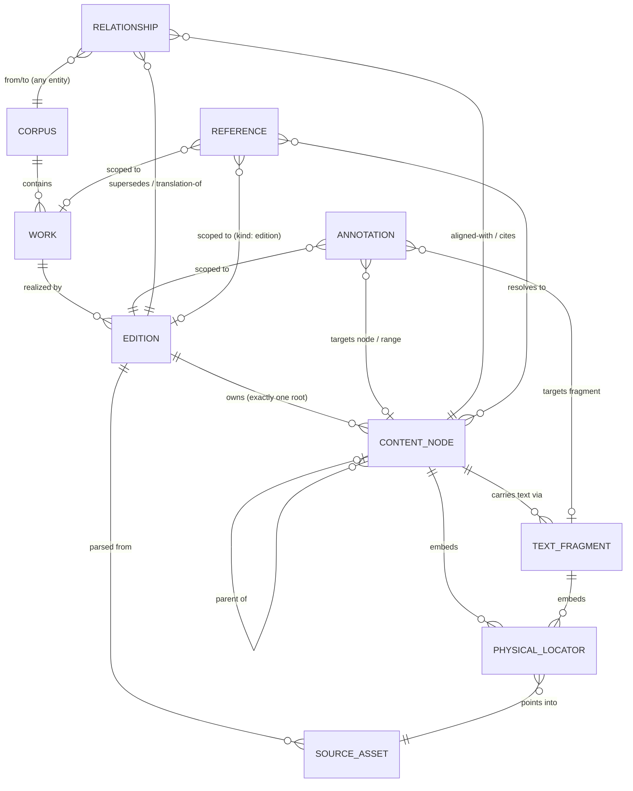
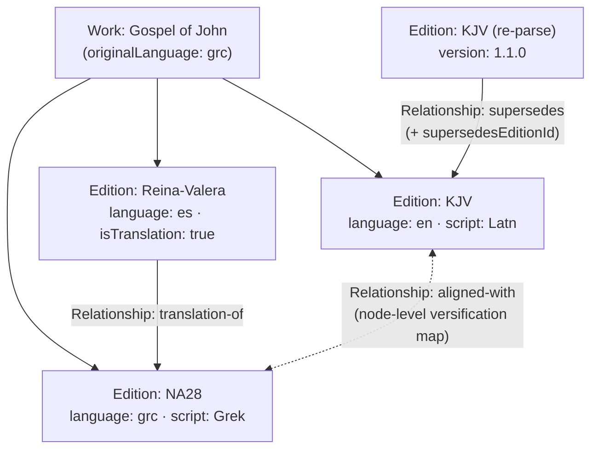

# 01 — Domain Model

This document defines the bounded contexts and the entity catalog of the **Context Fabric canonical content graph, v1**: what each entity is, which fields it carries (exactly as declared in the CI-validated JSON Schemas under [`packages/common/src/common/schemas/context_fabric/v1/`](../../../packages/common/src/common/schemas/context_fabric/v1)), the cardinalities between entities, and the modeling rules that govern semantic vs structural nodes, text-bearing vs non-text-bearing nodes, and the multi-edition/language model. The schemas are the source of truth; this document explains them.

See also: [README.md](README.md) · [02-node-taxonomy.md](02-node-taxonomy.md) · [03-references.md](03-references.md) · [04-physical-location.md](04-physical-location.md) · [05-api-payloads.md](05-api-payloads.md) · [06-queries-and-storage.md](06-queries-and-storage.md) · [07-migration-mapping.md](07-migration-mapping.md) · [08-invariants-and-versioning.md](08-invariants-and-versioning.md)

## 1. Bounded contexts

Context Fabric sits between the existing conversion pipeline and the client-facing delivery surfaces. Four contexts, each with a clear owner set of entities:

| Context | Responsibility | Owns / produces |
|---|---|---|
| **Ingestion** | Parse source formats (EPUB/HTML/PDF/TEI/plain/AV) and convert into the graph. Today: `admin.parsers` → `Document`/`Unit` → `admin.converters` walker. | SourceAsset; produces Edition + ContentNode + TextFragment trees with Provenance |
| **Canonical Content Graph** | The stable, source-format-independent model this spec defines. Identity, hierarchy, text, physical mapping, references. | Corpus, Work, Edition, ContentNode, TextFragment, PhysicalLocator (embedded), Reference, Relationship |
| **Delivery / API** | Serve denormalized read payloads (`NodeResponse`, `RangeResponse`, `ResolveResponse`, `SearchResponse`) to clients (MCP tools, desktop apps). | API payload envelopes ([api-payloads.schema.json](../../../packages/common/src/common/schemas/context_fabric/v1/api-payloads.schema.json)) |
| **Annotation & Enrichment** | Standoff notes, cross-references, alignment, validation/correction workflows layered on the graph without mutating base text. | Annotation, Relationship (enrichment kinds), Provenance corrections |

Boundary rules:

- Ingestion writes the graph but never invents identity semantics: every entity it emits carries `provenance` and (where applicable) `sourceLocalId`/locators pointing back to its SourceAsset.
- The graph never depends on delivery concerns; payload envelopes *embed* graph entities unchanged (`NodePayload` is a `ContentNode` plus inlined fragments/children/ref/annotations).
- Annotation is strictly standoff: it targets graph entities by id and never alters `TextFragment.text`. Corrections are recorded append-only in `provenance.corrections`.

## 2. Entity catalog

Conventions used below: **Req** = required by the schema. Types named `Id`, `Slug`, `SemVer`, `LangTag`, `ScriptCode`, `Code`, `NamespacedType`, `NodeCategory`, `Ext`, `Confidence`, `Provenance`, `EntityRef`, `Creator`, `BBox` are the shared `$defs` in [common.defs.schema.json](../../../packages/common/src/common/schemas/context_fabric/v1/common.defs.schema.json). `Id` is an opaque UUID (UUIDv7 recommended) and is the **only** carrier of identity — never labels, refs, or paths. `ext` is the single lossless extension object (namespaced keys such as `src/epub`, `tei`, `x-vendor`), round-tripped untouched.

### 2.1 Corpus

A curated collection of works ("Bibles", "Early Church Letters", "Lecture Archive"). Top-level container and unit of distribution. Schema: [corpus.schema.json](../../../packages/common/src/common/schemas/context_fabric/v1/corpus.schema.json).

| Field | Type | Req | Description |
|---|---|---|---|
| `schemaVersion` | SemVer | ✔ | Context Fabric schema version of the payload |
| `id` | Id | ✔ | Opaque stable identifier |
| `slug` | Slug | ✔ | URL-safe lowercase identifier, unique within its parent scope |
| `title` | string (minLength 1) | ✔ | Display title |
| `description` | string | | Free-form description |
| `languages` | LangTag[] | | Languages present across the corpus's editions |
| `publisher` | string | | |
| `rights` | string | | License / rights statement for the collection as a whole |
| `createdAt`, `updatedAt` | date-time | | |
| `ext` | Ext | | Lossless extensions |

### 2.2 Work

An abstract intellectual creation independent of any particular text, translation, or physical form (FRBR "work"): the Gospel of John, the Quran, a specific letter, a speech. Schema: [work.schema.json](../../../packages/common/src/common/schemas/context_fabric/v1/work.schema.json).

| Field | Type | Req | Description |
|---|---|---|---|
| `schemaVersion` | SemVer | ✔ | |
| `id` | Id | ✔ | |
| `corpusId` | Id | ✔ | Owning Corpus |
| `slug` | Slug | ✔ | |
| `title` | string (minLength 1) | ✔ | |
| `sortTitle` | string | | Title normalized for sorting |
| `creators` | Creator[] | | `{name, role?}` — author, translator, editor, speaker… |
| `originalLanguage` | LangTag | | |
| `genre` | string | | Free-form hint ('scripture', 'monograph', 'letter', …). Informative only; never drives parsing or rendering |
| `refScheme` | Slug | | Default canonical reference scheme ('bible', 'quran', 'monograph'); editions may override |
| `date` | string | | Composition date or range, free-form ('1863', 'c. 90 AD') |
| `ext` | Ext | | |

Invariant: a Work carries no text and no structure — those belong to its Editions.

### 2.3 Edition

A concrete realization of a Work in one language/script/versification: KJV of John, Hafs recension of the Quran, the 1994 critical edition of a letter. **All ContentNodes belong to exactly one Edition.** Re-parses produce a *new* Edition revision linked via `Relationship(kind: supersedes)` — node ids are never mutated. Schema: [edition.schema.json](../../../packages/common/src/common/schemas/context_fabric/v1/edition.schema.json).

| Field | Type | Req | Description |
|---|---|---|---|
| `schemaVersion` | SemVer | ✔ | |
| `id` | Id | ✔ | |
| `workId` | Id | ✔ | Realized Work |
| `slug` | Slug | ✔ | |
| `title` | string (minLength 1) | ✔ | |
| `language` | LangTag | ✔ | Edition language; per-node overrides allowed |
| `script` | ScriptCode | | ISO 15924 |
| `isTranslation` | boolean (default false) | | |
| `publisher`, `date`, `rights` | string | | Publication metadata, free-form |
| `version` | SemVer | | Revision of THIS edition's converted content (bumped on re-parse); unrelated to `schemaVersion` |
| `supersedesEditionId` | Id | | Convenience mirror of the `supersedes` Relationship to the prior revision |
| `refScheme` | Slug | | Canonical reference scheme; overrides `Work.refScheme` |
| `structureProfile` | object | | `{levels: StructureLevel[]}` (minItems 1) — the declared reference hierarchy, outermost first. Only node types listed here participate in canonical references; all other node types are ordinary structure |
| `sourceAssetIds` | Id[] | | Assets this edition was parsed from |
| `provenance` | Provenance | | Parser name/version/profile, convertedAt, confidence, validationState, corrections |
| `ext` | Ext | | |

`StructureLevel`: `{levelType: NamespacedType (req), label?: string, addressedBy?: "code" | "ordinal" (default "ordinal")}` — whether references address the level by stable code (book `JHN`) or by 1-based canonical ordinal (chapter 3).

### 2.4 ContentNode

One addressable typed node in an Edition's ordered hierarchy: book, chapter, verse, surah, paragraph, table, figure, utterance… Depth is unconstrained. **Text lives in TextFragments, never on the node itself**; non-text-bearing nodes simply have no fragments. Schema: [content-node.schema.json](../../../packages/common/src/common/schemas/context_fabric/v1/content-node.schema.json).

| Field | Type | Req | Description |
|---|---|---|---|
| `schemaVersion` | SemVer | ✔ | |
| `id` | Id | ✔ | |
| `editionId` | Id | ✔ | Owning Edition |
| `parentId` | Id \| null | | `null` only for the edition's single root node |
| `ordinal` | integer ≥ 0 | ✔ | 0-based position among siblings; with the ancestor chain, defines document order |
| `depth` | integer ≥ 0 | | 0 for the root. Derivable; included for cheap client rendering |
| `category` | NodeCategory | ✔ | Closed rendering/query category (see [02-node-taxonomy.md](02-node-taxonomy.md)) |
| `type` | NamespacedType | ✔ | Open namespaced type (`bible:verse`, `generic:paragraph`, …) |
| `code` | Code | | Stable canonical code when this node is a **code-addressed** reference level (e.g. `JHN`). Language-independent |
| `refOrdinal` | integer ≥ 1 | | 1-based canonical number when this node is an **ordinal-addressed** reference level (chapter 3, verse 16, page 2). Independent of `ordinal`: canonical numbering may skip or repeat positions |
| `label` | string | | Display label ('John', '3', 'Chapter IV', 'Interviewer'). **NEVER used for reference resolution** |
| `heading` | string | | Heading text, when not modeled as a child heading node |
| `language` | LangTag | | Override of the edition language for this subtree |
| `script` | ScriptCode | | |
| `childCount` | integer ≥ 0 | | |
| `sourceLocalId` | string | | The node's id in the source document (EPUB anchor, TEI `xml:id`, parser `Unit.id`). Not globally unique |
| `locators` | PhysicalLocator[] | | Physical location(s) of the whole node; a node spanning pages carries one locator per page region. Fragment-level locators preferred when finer granularity exists |
| `provenance` | Provenance | | |
| `ext` | Ext | | |

Invariants: exactly one root per edition (`parentId: null`); `(parentId, ordinal)` is unique among siblings; `category`+`type` are both always present; a node is a reference level iff its `type` appears in the edition's `structureProfile.levels`.

### 2.5 TextFragment

A contiguous run of text belonging to exactly one ContentNode — the **only carrier of text** in the graph, and the join between logical and physical structure: a node spanning two pages has (at least) two fragments, each with its own PhysicalLocator; a page holding parts of several nodes holds one fragment per node. Schema: [text-fragment.schema.json](../../../packages/common/src/common/schemas/context_fabric/v1/text-fragment.schema.json).

| Field | Type | Req | Description |
|---|---|---|---|
| `schemaVersion` | SemVer | ✔ | |
| `id` | Id | ✔ | |
| `nodeId` | Id | ✔ | Owning ContentNode |
| `ordinal` | integer ≥ 0 | ✔ | 0-based order of this fragment within its node |
| `text` | string | ✔ | The text run |
| `after` | string (default "") | | Separator that follows this fragment when concatenating node text (mirrors Text-Fabric's `after` feature) |
| `language`, `script` | LangTag / ScriptCode | | Overrides for this run |
| `charStart`, `charEnd` | integer ≥ 0 | | Offsets of this fragment within the node's concatenated plain text |
| `locators` | PhysicalLocator[] | | Physical position of this run |
| `confidence` | Confidence (0–1) | | OCR/parse confidence |
| `ext` | Ext | | |

### 2.6 PhysicalLocator

An **embeddable value object** (no `id`, no independent lifecycle) mapping content back to a coordinate in a SourceAsset: page, printed page label, bounding box, character offsets, timecodes, or a source-native fragment id. Logical structure never depends on locators. Schema: [physical-locator.schema.json](../../../packages/common/src/common/schemas/context_fabric/v1/physical-locator.schema.json).

| Field | Type | Req | Description |
|---|---|---|---|
| `sourceAssetId` | Id | | Asset being located into |
| `pageIndex` | integer ≥ 0 | ◇ | 0-based physical page index (PDF page, scan index). NOT the printed number |
| `printedLabel` | string | ◇ | Page label as printed ('23', 'xiv', 'B-4'). May not be numeric or unique |
| `bbox` | BBox | ◇ | `{x, y, width, height, unit: pt\|px\|ratio}` — rectangle on the page, origin top-left |
| `charStart`, `charEnd` | integer ≥ 0 | ◇ (start) | Offsets in the asset's extracted text stream |
| `timeStart`, `timeEnd` | number ≥ 0 | ◇ (start) | Seconds from the start of an audio/video asset |
| `sourceFragmentId` | string | ◇ | Source-native fragment id: EPUB/HTML anchor, TEI `xml:id`, OCR block id, subtitle cue id |
| `ext` | Ext | | |

◇ = at least one of `pageIndex`, `printedLabel`, `bbox`, `charStart`, `timeStart`, `sourceFragmentId` is required (`anyOf` in the schema).

### 2.7 Reference

A canonical or edition-specific address for content: an ordered list of typed segments scoped to (scheme, work, edition?). Resolution uses **only** segment codes and ordinals via the scheme's alias registry — display labels are never resolution inputs. `Bible/KJV/John/3/16` normalizes to scheme=`bible`, edition=`kjv`, segments `[book JHN, chapter 3, verse 16]`. Schema: [reference.schema.json](../../../packages/common/src/common/schemas/context_fabric/v1/reference.schema.json).

| Field | Type | Req | Description |
|---|---|---|---|
| `scheme` | Slug | ✔ | Reference scheme id from the scheme registry ('bible', 'quran', 'monograph', 'epistolary', …) |
| `kind` | "canonical" \| "edition" (default "canonical") | | Canonical addresses are edition-independent within the scheme; edition addresses depend on one edition's structure (page-based refs, edition-specific versification) |
| `workId` / `workSlug` | Id / Slug | | Work scope |
| `editionId` / `editionSlug` | Id / Slug | | Edition scope (required in spirit for `kind: edition`) |
| `segments` | Segment[] (minItems 1) | ✔ | Ordered typed segments, outermost first |
| `canonical` | string | | Serialized machine form: `scheme/token/token…` where a token is the segment's code, its bare ordinal, or `<level>-<ordinal>` when ambiguous (`bible/JHN/3/16`, `letter/page-2/paragraph-1`). Deterministically regenerable from the structured fields |
| `display` | string | | Human-readable ('John 3:16 (KJV)'). Informative only |
| `ext` | Ext | | |

`Segment`: `{levelType: NamespacedType (req), ordinal?: integer ≥ 1, code?: Code}` — at least one of `ordinal`/`code` required; both may be present.

### 2.8 SourceAsset

An ingested input file or media object an Edition was parsed from: the EPUB, PDF, TEI/XML, HTML, plaintext, OCR bundle, audio or video recording. PhysicalLocators point back into SourceAssets. Schema: [source-asset.schema.json](../../../packages/common/src/common/schemas/context_fabric/v1/source-asset.schema.json).

| Field | Type | Req | Description |
|---|---|---|---|
| `schemaVersion` | SemVer | ✔ | |
| `id` | Id | ✔ | |
| `editionId` | Id | | Edition parsed from this asset |
| `sourceFormat` | enum: `epub`, `html`, `xml`, `tei`, `pdf`, `plain`, `tf_zip`, `tei_zip`, `audio`, `video`, `image`, `other` | ✔ | Superset of the parser `SourceFormat` enum in `admin.parsers.schema` |
| `mediaType` | string | | IANA media type ('application/epub+zip', 'audio/mpeg') |
| `uri` | uri | | Where the asset lives (storage URL, `hf://` path) |
| `filename` | string | | |
| `sha256` | string (64 hex) | | Content hash |
| `byteSize`, `pageCount` | integer ≥ 0 | | |
| `durationSeconds` | number ≥ 0 | | For AV assets |
| `ext` | Ext | | |

### 2.9 Annotation

Standoff content attached to a node, fragment, or range: footnotes, endnotes, editorial notes, cross-references, glosses, media attachments, reader comments. **Annotations never alter the base text.** Schema: [annotation.schema.json](../../../packages/common/src/common/schemas/context_fabric/v1/annotation.schema.json).

| Field | Type | Req | Description |
|---|---|---|---|
| `schemaVersion` | SemVer | ✔ | |
| `id` | Id | ✔ | |
| `editionId` | Id | | Edition the annotation lives in |
| `kind` | NamespacedType | ✔ | Open namespaced kind: `note:footnote`, `note:editorial`, `ref:crossref`, `media:image`, `user:comment` |
| `target` | AnnotationTarget | ✔ | Exactly one anchoring style: `{nodeId}` \| `{fragmentId}` \| `{range: {startNodeId (req), endNodeId (req), startChar?, endChar?}}` |
| `body` | AnnotationBody | | Content: `text` (inline), `nodeId` (pointer to a node subtree for rich bodies), `assetId` (media), `uri` (external), `reference` (cross-references) |
| `marker` | string | | Visible anchor marker in the text ('\*', '1', '†') |
| `createdBy` | string | | |
| `createdAt` | date-time | | |
| `provenance` | Provenance | | |
| `ext` | Ext | | |

### 2.10 Relationship

A typed directed edge between any two Context Fabric entities: edition **supersedes** edition, edition **translation-of** edition, node **aligned-with** node (versification mapping), node **cites** work, annotation **derived-from** asset. Schema: [relationship.schema.json](../../../packages/common/src/common/schemas/context_fabric/v1/relationship.schema.json).

| Field | Type | Req | Description |
|---|---|---|---|
| `schemaVersion` | SemVer | ✔ | |
| `id` | Id | ✔ | |
| `kind` | string (pattern) | ✔ | Well-known kinds: `supersedes`, `translation-of`, `aligned-with`, `cites`, `derived-from`, `cross-reference`. Custom kinds must be namespaced (`myapp:parallel-passage`) |
| `from` | EntityRef | ✔ | `{entity: corpus\|work\|edition\|node\|fragment\|asset\|annotation, id}` |
| `to` | EntityRef | ✔ | Same shape |
| `confidence` | Confidence | | For machine-produced edges (alignment) |
| `note` | string | | |
| `ext` | Ext | | |

## 3. Entity-relationship diagram

Notes: PhysicalLocator is an embedded value object, not a stored entity — the diagram shows composition, not foreign keys. Reference is a value object too (it appears in payloads, Annotation bodies, and resolution APIs); it resolves to nodes, it does not own them. Relationship's `from`/`to` are `EntityRef`s and may point at **any** entity type; the three edges drawn are the most common.

## 4. Semantic vs structural nodes

Both kinds are ordinary ContentNodes — the distinction is a *role*, not a subclass:

- **Semantic nodes** carry meaning and bear references: `bible:verse`, `quran:surah`, `acad:section`, `letter:body`. They usually have `code` or `refOrdinal` set and their `type` appears in the edition's `structureProfile.levels`.
- **Structural nodes** are layout or physical artifacts: a page, a line, a `generic:element` div soup from HTML. They organize or locate content without adding meaning.

The **Edition's `structureProfile` is the single switch** that declares which types are reference levels for that edition. Nothing about a type makes it inherently semantic; `phys:page` demonstrates both roles:

- **Pages as the addressing scheme** (a scanned letter, a manuscript facsimile): the page is how humans cite the content — "Letter to Harrington, p. 2, ¶1". Model each page as a ContentNode with `category: milestone`, `type: phys:page`, `refOrdinal` set, and list `phys:page` in `structureProfile.levels`. Paragraphs parent under their page node, and references like `letter/page-2/paragraph-1` resolve through it (see [examples/letter-page.json](../../../packages/common/src/common/schemas/context_fabric/v1/examples/letter-page.json)).
- **Pages as mere physical accident** (a novel, where citation is chapter/paragraph): pages do **not** become nodes at all. Page position is recorded as `PhysicalLocator.pageIndex`/`printedLabel` on nodes and fragments. Logical structure stays purely semantic, and the same edition text can be re-laid-out without touching the tree.

Rule of thumb: *if people cite it, it's a node in the structure profile; if it merely says where ink landed, it's a locator.*

## 5. Text-bearing vs non-text-bearing nodes

- A node's text is exactly the ordered concatenation of its own TextFragments (`text` + `after` per fragment). ContentNode has **no text field** by design.
- **Text-bearing nodes** (verses, paragraphs, utterances, headings) own one or more fragments. Multiple fragments per node arise wherever physical structure interrupts a logical unit — a paragraph split across a page break holds one fragment per page, each with its own locators.
- **Container nodes** (books, chapters, sections) typically own no fragments of their own; their readable text is the concatenation of their descendants' fragments in document order. An empty container (a chapter shell parsed before its content, a blank division) is valid — `childCount: 0` and no fragments.
- **Figures, media, tables, milestones** are non-text-bearing by nature: they carry `locators` (where the image/region/timespan lives in the SourceAsset) and `ext` (source attributes, dimensions, OCR block ids), but no fragments. A caption, if present, is a child text-bearing node (or the `heading` field), not fragment text on the figure itself.
- In API payloads, `NodePayload.fragments` is absent/empty both for genuinely non-text-bearing nodes and for containers served shallow; `NodePayload.text` is a convenience concatenation for simple clients.

## 6. Multi-edition, language, and script model

One Work fans out to any number of Editions, and everything language- or versification-specific hangs off the Edition:

- **Language and script** are declared once on the Edition (`language` required, `script` optional) and inherited by every node and fragment. Per-node `language`/`script` override the edition for a subtree (a Greek quotation inside an English edition); per-fragment overrides handle mixed runs inside one node.
- **Translations** are separate Editions (`isTranslation: true`) linked to their source edition with `Relationship(kind: translation-of)`. There is no "primary" edition in the schema; the Work is the language-neutral anchor.
- **Versification / structure differences** between editions are expected: each Edition declares its own `structureProfile`, and node-level `Relationship(kind: aligned-with)` edges (with `confidence`) map corresponding nodes across editions when numbering diverges.
- **Revision chain**: a re-parse never mutates an existing Edition's nodes. It produces a new Edition with a bumped `version` (SemVer, independent of `schemaVersion`), a `Relationship(kind: supersedes)` edge to the prior revision, and the convenience mirror `supersedesEditionId`. Old node ids stay valid forever; clients follow the chain forward when they want the latest content.
- **Corpus-level view**: `Corpus.languages` aggregates the languages present across its editions, for discovery only.
