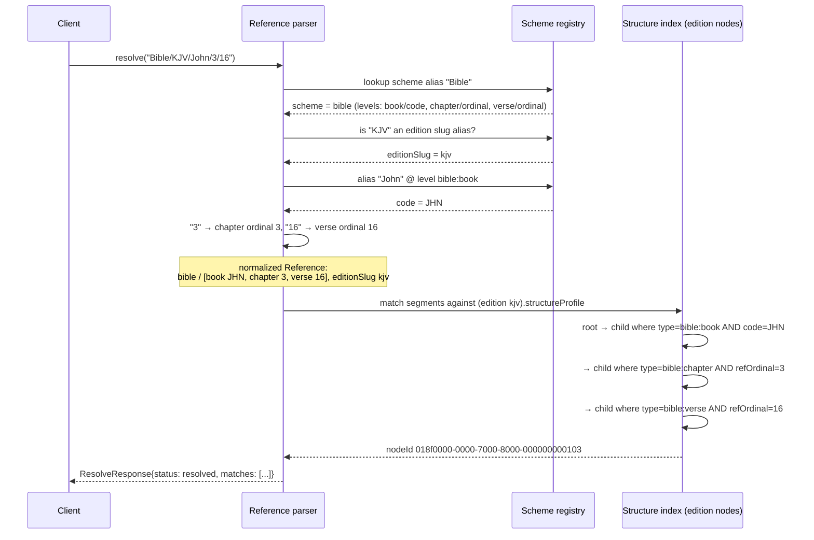

# 03 — References: canonical addressing and resolution

This document specifies how Context Fabric addresses content: the Reference value object (an ordered list of typed segments scoped to a scheme, and optionally a work and edition), the serialized canonical string form, the scheme registry that drives resolution, and the resolution algorithm that turns a human-entered string like `Bible/KJV/John/3/16` into a node id. Identity and addressing are deliberately separate axes — a node's identity is its opaque UUIDv7 `id` and nothing else; a Reference is a *query* that resolves to ids through codes and 1-based ordinals, never through display labels. The machine-readable contract lives in [reference.schema.json](../../../packages/common/src/common/schemas/context_fabric/v1/reference.schema.json), with the per-edition binding declared in [edition.schema.json](../../../packages/common/src/common/schemas/context_fabric/v1/edition.schema.json) (`structureProfile`) and the address components carried on nodes in [content-node.schema.json](../../../packages/common/src/common/schemas/context_fabric/v1/content-node.schema.json) (`code`, `refOrdinal`).

See also: [README](README.md) · [01 — Domain model](01-domain-model.md) · [02 — Node taxonomy](02-node-taxonomy.md) · [04 — Physical location](04-physical-location.md) · [05 — API payloads](05-api-payloads.md) · [06 — Queries & storage](06-queries-and-storage.md) · [07 — Migration mapping](07-migration-mapping.md) · [08 — Invariants & versioning](08-invariants-and-versioning.md)

## 1. Requirements and non-goals

**Requirements**

- **Stable across renames and translations.** `bible/JHN/3/16` resolves the same verse whether the edition titles the book "John", "Johannes", or "Κατά Ιωάννην". Codes (`JHN`) and canonical ordinals (`3`, `16`) are language-independent; display labels are presentation-only and are *never* resolution inputs ([content-node.schema.json](../../../packages/common/src/common/schemas/context_fabric/v1/content-node.schema.json) `label`: "NEVER used for reference resolution").
- **No display-label dependence.** Human-friendly inputs ("John", "Al-Baqarah") are accepted only at the parsing edge, where the scheme's alias registry normalizes them to codes/ordinals *before* resolution begins.
- **Canonical and edition-specific addressing.** `Reference.kind` distinguishes `canonical` addresses (edition-independent within a scheme — any Bible edition can answer `bible/JHN/3/16`) from `edition` addresses (meaningful only against one edition's structure — a page-based letter citation, a versification variant).
- **Ranges.** A start/end reference pair expands, server-side, to the ordered run of nodes between them in document order (§6).

**Non-goals**

- References are not identifiers. Two editions resolve `bible/JHN/3/16` to two different node ids; storing a Reference where an id is required is a modeling error.
- References do not encode physical location. Page/timecode addressing belongs to [PhysicalLocator](04-physical-location.md), except where a page is itself a declared reference level (`kind: "edition"`, §7 of doc 04).
- v1 defines no cross-scheme translation (e.g. mapping a `bible` reference into a `monograph` structure).

## 2. Reference grammar

### 2.1 Serialized canonical form (EBNF)

The `canonical` string is machine-oriented, deterministic, and regenerable from the structured fields ([reference.schema.json](../../../packages/common/src/common/schemas/context_fabric/v1/reference.schema.json) `canonical`):

```ebnf
reference      = scheme , { "/" , token } ;          (* one token per segment, ≥ 1 *)
scheme         = slug ;                               (* ^[a-z0-9][a-z0-9-]*$ *)
token          = code | bare-ordinal | level-ordinal ;
code           = letter-digit , { letter-digit | "." | "_" | "-" } ;
                                                      (* Code: ^[A-Za-z0-9][A-Za-z0-9._-]*$, ≤ 64 *)
bare-ordinal   = nonzero-digit , { digit } ;          (* 1-based *)
level-ordinal  = level-name , "-" , bare-ordinal ;    (* e.g. "chapter-4", "page-2" *)
level-name     = lowercase local name of the segment's levelType
                 (the part after ":" in the NamespacedType, e.g. "chapter" of "generic:chapter") ;
```

Examples: `bible/JHN/3/16`, `quran/2/255`, `monograph/chapter-4/section-2/paragraph-3`, `letter/page-2/paragraph-1`, and with the optional sub-block levels of §3.1: `bible/GEN/1/1/word-3`, `bible/GEN/1/1/clause-2/word-1`.

### 2.2 JSON structural form

Mirrors [reference.schema.json](../../../packages/common/src/common/schemas/context_fabric/v1/reference.schema.json) exactly:

| Field | Type | Req. | Meaning |
|---|---|---|---|
| `scheme` | Slug | yes | Scheme id from the registry (`bible`, `quran`, `monograph`, `epistolary`, …). |
| `kind` | `"canonical"` \| `"edition"` | no (default `"canonical"`) | Edition-independent vs edition-bound address. |
| `workId` / `workSlug` | Id / Slug | no | Optional work scope. |
| `editionId` / `editionSlug` | Id / Slug | no | Optional edition scope; effectively required when `kind: "edition"`. |
| `segments` | `Segment[]`, `minItems: 1` | yes | Ordered, outermost first. |
| `canonical` | string | no | Serialized form per §2.1; derivable, cacheable. |
| `display` | string | no | Human label (`"John 3:16 (KJV)"`). Informative only. |
| `ext` | Ext | no | Namespaced extension data. |

Each **Segment** (`additionalProperties: false`):

| Field | Type | Req. | Meaning |
|---|---|---|---|
| `levelType` | NamespacedType | yes | The level's node type (`bible:book`, `quran:ayah`, `phys:page`). |
| `ordinal` | integer ≥ 1 | anyOf | 1-based canonical number, matched against `ContentNode.refOrdinal`. |
| `code` | Code | anyOf | Stable code, matched against `ContentNode.code`. |

A segment must carry `ordinal` or `code` (both allowed). Which one is *expected* is declared per level by the edition's `structureProfile.levels[].addressedBy` (§3).

### 2.3 Token disambiguation rules

Parsing a serialized token, in order:

1. **All digits** → `bare-ordinal`. Assigned to the next unfilled level of the scheme's declared level sequence, left to right. Legal only when token *position* uniquely determines the level — i.e. the reference starts at the top of the level sequence with no gaps (`quran/2/255`: position 1 = surah, position 2 = ayah).
2. **Matches `level-name "-" digits`** where `level-name` is the local name of a declared level → `level-ordinal`. Required whenever a bare number would be ambiguous: schemes with a variable-depth or optional-level hierarchy (`monograph` documents may or may not have sections), references that skip levels, `phys:page` levels (whose bare number could be mistaken for a content ordinal), and the optional `ling:*` sub-block levels of §3.1 (`sentence-2`, `clause-1`, `word-3`). This is why the monograph and letter examples spell every token out.
3. **Anything else** → `code`. Looked up in the scheme's alias registry and normalized to the canonical `Code` for a code-addressed level (`John` → `JHN`).

Serialization is the inverse and is deterministic per scheme: emit `code` for code-addressed levels; emit `bare-ordinal` when the scheme's fixed level sequence makes the position unambiguous; otherwise emit `level-ordinal`. A given structured Reference always serializes to exactly one canonical string.

## 3. Scheme registry and structure profiles

A **scheme** is a registered addressing convention. Its registry entry declares:

- the **level sequence** — ordered `levelType`s, outermost first;
- per level, **`addressedBy`** — `code` or `ordinal` (same enum as `StructureLevel.addressedBy` in [edition.schema.json](../../../packages/common/src/common/schemas/context_fabric/v1/edition.schema.json));
- **alias tables** — multilingual, case/diacritic-folded mappings from human names to codes (`"John"`, `"Jn"`, `"Johannes"` → `JHN`) or to full segment lists for named refs (§6);
- the default **token style** (bare vs level-ordinal, per §2.3).

An **Edition binds a scheme to concrete nodes** via `structureProfile.levels`: only node types listed there participate in canonical references; every other node type is ordinary structure. A node at a code-addressed level carries `ContentNode.code`; a node at an ordinal-addressed level carries `ContentNode.refOrdinal` (1-based canonical number — distinct from `ContentNode.ordinal`, the 0-based sibling position: canonical numbering may skip or repeat positions, document order may not).

| Scheme | Level sequence (`levelType` → `addressedBy`) | Token style | Typical `kind` |
|---|---|---|---|
| `bible` | `bible:book` → code, `bible:chapter` → ordinal, `bible:verse` → ordinal | code + bare ordinals | canonical |
| `quran` | `quran:surah` → ordinal, `quran:ayah` → ordinal | bare ordinals (fixed 2-level) | canonical |
| `monograph` | `generic:chapter` → ordinal, `generic:section` → ordinal, `generic:paragraph` → ordinal (middle levels optional) | level-ordinal | canonical |
| `epistolary` (`letter`) | `phys:page` → ordinal, `letter:paragraph` → ordinal | level-ordinal | **edition** (page layout is a property of one witness) |
| `academic` | `acad:section` → ordinal, `acad:paragraph` → ordinal | level-ordinal | canonical |
| `oratory` | `oratory:paragraph` → ordinal | level-ordinal | canonical |
| `transcript` | `transcript:utterance` → ordinal | level-ordinal | canonical |

### 3.1 Optional sub-block levels (`ling:*`)

Every scheme's level sequence implicitly ends with three optional trailing levels, registered in [02 §4.8](02-node-taxonomy.md): `ling:sentence` → ordinal, `ling:clause` → ordinal, `ling:word` → ordinal. They sit under the scheme's finest `block` level (`bible:verse`, `quran:ayah`, `*:paragraph`). Rules:

- An edition **opts in** by listing the levels it has in `structureProfile.levels`; `StructureLevel` needs no new field. An edition that lists none is unaffected.
- Tokens are always `level-ordinal` (§2.3 rule 2): `sentence-N`, `clause-N`, `word-N`. Levels above them keep their existing token style, so every pre-existing canonical string is unchanged.
- Any of the three may be skipped. A skipped level counts under the nearest **present** ancestor: `bible/GEN/1/1/word-3` is the third word of the verse, `bible/GEN/1/1/clause-2/word-1` the first word of its second clause. Both may name the same node and must then resolve identically.
- A Reference containing a `ling:*` segment is **`kind: "edition"`** and requires `editionSlug`/`editionId`; the parser rejects it as `canonical`. Sentence, clause and word boundaries are properties of one analysis, not of the work. Cross-edition word alignment uses `aligned-with` edges (§7), never ordinal equality.
- Ranges (§6) and failure modes (§8) are unchanged; an edition without the level answers `partial` with the deepest matched ancestor.

The compact `co0001_bk001_ch001_pa001_st001_cl001_wo001` token is a lossless encoding of such an edition-kind Reference; see [Inter-corpus references](../inter-corpus-refs.md).

## 4. Alias resolution

Resolving `Bible/KJV/John/3/16`:



Matching at each step uses **only** `ContentNode.code` (code-addressed levels) or `ContentNode.refOrdinal` (ordinal-addressed levels), never `label` or `heading`.

**Alias matching rules.** Alias lookup is case-insensitive and Unicode-diacritic-insensitive (NFKD fold, strip combining marks, casefold): `john`, `JOHN`, `Jóhn` all hit the `JHN` entry. Alias tables are multilingual — `Johannes` (de), `Jean` (fr), `Ιωάννην` (el) may all map to `JHN`; `البقرة` and `Al-Baqarah` both map to surah ordinal 2. Aliases are inputs to normalization only; the normalized Reference and its `canonical` string contain codes and ordinals exclusively.

## 5. Worked resolutions

All JSON below is copied verbatim from the CI-validated fixtures listed in [examples/index.json](../../../packages/common/src/common/schemas/context_fabric/v1/examples/index.json).

### 5.1 `Bible/KJV/John/3/16` → `bible/JHN/3/16`

Normalized Reference (from [scripture-node.json](../../../packages/common/src/common/schemas/context_fabric/v1/examples/scripture-node.json)):

```json
{
  "scheme": "bible",
  "kind": "canonical",
  "workSlug": "john",
  "editionSlug": "kjv",
  "segments": [
    { "levelType": "bible:book", "code": "JHN" },
    { "levelType": "bible:chapter", "ordinal": 3 },
    { "levelType": "bible:verse", "ordinal": 16 }
  ],
  "canonical": "bible/JHN/3/16",
  "display": "John 3:16 (KJV)"
}
```

Matched node chain: book node with `code: "JHN"` → chapter node with `refOrdinal: 3` → verse node `018f0000-0000-7000-8000-000000000103` with `refOrdinal: 16` (note its sibling `ordinal` is 15 — 0-based document position, not the address). The alias `KJV` scopes resolution to `editionSlug: "kjv"`; the address itself stays `kind: "canonical"`.

### 5.2 `Quran/2/255` → `quran/2/255`

```json
{
  "scheme": "quran",
  "kind": "canonical",
  "workSlug": "quran",
  "segments": [
    { "levelType": "quran:surah", "ordinal": 2 },
    { "levelType": "quran:ayah", "ordinal": 255 }
  ],
  "canonical": "quran/2/255",
  "display": "Q 2:255"
}
```

Both tokens are all-digits; the fixed two-level sequence assigns them positionally (surah 2, ayah 255). Matched chain: surah node `refOrdinal: 2` → ayah node `refOrdinal: 255`.

### 5.3 `Book/Chapter-4/Section-2/Paragraph-3` → `monograph/chapter-4/section-2/paragraph-3`

From [book-chapter.json](../../../packages/common/src/common/schemas/context_fabric/v1/examples/book-chapter.json):

```json
{
  "scheme": "monograph",
  "kind": "canonical",
  "workSlug": "on-reading-collections",
  "segments": [
    { "levelType": "generic:chapter", "ordinal": 4 },
    { "levelType": "generic:section", "ordinal": 2 },
    { "levelType": "generic:paragraph", "ordinal": 3 }
  ],
  "canonical": "monograph/chapter-4/section-2/paragraph-3",
  "display": "Chapter 4, Section 2, ¶3"
}
```

`Chapter-4` etc. parse under rule 2 of §2.3 (level-ordinal); bare `4/2/3` would be rejected because monograph depth is variable. Matched chain: chapter `refOrdinal: 4` → section `refOrdinal: 2` → paragraph node `018f0001-0000-7000-8000-000000000103`, `refOrdinal: 3`.

### 5.4 `Letter/Page-2/Paragraph-1` → `letter/page-2/paragraph-1` (kind: edition)

From [letter-page.json](../../../packages/common/src/common/schemas/context_fabric/v1/examples/letter-page.json):

```json
{
  "scheme": "letter",
  "kind": "edition",
  "workSlug": "letter-to-harrington-1863",
  "editionSlug": "scan-1863",
  "segments": [
    { "levelType": "phys:page", "ordinal": 2 },
    { "levelType": "letter:paragraph", "ordinal": 1 }
  ],
  "canonical": "letter/page-2/paragraph-1",
  "display": "Letter, p. 2, ¶1"
}
```

`kind: "edition"`: page boundaries belong to the 1863 scan, so the address is only meaningful against `editionSlug: "scan-1863"`. Matched chain: `phys:page` node `refOrdinal: 2` (a `milestone`-category node *in the logical tree* — see [04 §7](04-physical-location.md)) → paragraph node `018f0002-0000-7000-8000-000000000102`, `refOrdinal: 1`.

### 5.5 `Bible/KJV/John/3/16/word-3` → `bible/JHN/3/16/word-3` (kind: edition)

From [scripture-word.json](../../../packages/common/src/common/schemas/context_fabric/v1/examples/scripture-word.json):

```json
{
  "scheme": "bible",
  "kind": "edition",
  "workSlug": "john",
  "editionSlug": "kjv",
  "segments": [
    { "levelType": "bible:book", "code": "JHN" },
    { "levelType": "bible:chapter", "ordinal": 3 },
    { "levelType": "bible:verse", "ordinal": 16 },
    { "levelType": "ling:word", "ordinal": 3 }
  ],
  "canonical": "bible/JHN/3/16/word-3",
  "display": "John 3:16 (KJV), word 3"
}
```

The first three tokens parse as in §5.1; `word-3` parses under rule 2 of §2.3 as the optional `ling:word` level of §3.1, with `ling:sentence` and `ling:clause` skipped, so the ordinal counts words under the verse. The `ling:*` segment forces `kind: "edition"`. Matched chain: the §5.1 verse node `018f0000-0000-7000-8000-000000000103` → child where `type=ling:word` and `refOrdinal=3`: node `018f0000-0000-7000-8000-000000000303`, text "so" (`category: inline`, sibling `ordinal` 2).

## 6. Ranges and named references

**Ranges.** A range is a **pair of References** — `start` and `end` — of the same scheme (and, for `kind: "edition"`, the same edition). The server resolves both endpoints, then expands to every node between them **in document order** (the `ordinal`-under-ancestor ordering, not `refOrdinal` arithmetic — this makes ranges robust across skipped canonical numbers). The result is a `RangeResponse` ([api-payloads.schema.json](../../../packages/common/src/common/schemas/context_fabric/v1/api-payloads.schema.json)): `nodes[]` in order, `total`, and keyset pagination via `nextCursor`; its `ref` field echoes the reference that produced the run when applicable. Endpoints may differ in depth (`bible/JHN/3/16` → `bible/JHN/4`): the range covers from the first endpoint's first leaf to the last leaf under the second endpoint.

A range request and its expansion, structurally:

```json
{
  "start": { "scheme": "bible", "editionSlug": "kjv",
             "segments": [ { "levelType": "bible:book", "code": "JHN" },
                           { "levelType": "bible:chapter", "ordinal": 3 },
                           { "levelType": "bible:verse", "ordinal": 16 } ] },
  "end":   { "scheme": "bible", "editionSlug": "kjv",
             "segments": [ { "levelType": "bible:book", "code": "JHN" },
                           { "levelType": "bible:chapter", "ordinal": 3 },
                           { "levelType": "bible:verse", "ordinal": 18 } ] }
}
```

→ `RangeResponse{ nodes: [v16, v17, v18], total: 3, nextCursor: null }`. Both endpoints must resolve (`resolved` status individually) before expansion; a failed endpoint fails the whole range with that endpoint's failure status (§8).

**Named references.** The alias registry may map a name to a *complete segment list*, not just a single code: `"Ayat al-Kursi"` (any case/diacritics) → `quran/2/255`; `"the Golden Rule"` could map to a range pair. Named refs are pure registry entries — nothing on the node model changes, and the normalized Reference that comes out is indistinguishable from one typed as `Quran/2/255`.

## 7. Edition alignment (versification differences)

Editions of the same work can number the "same" content differently: Hebrew Psalm titles count as verse 1 (so MT `Psalm 51:3` = KJV `Psalm 51:1`), Greek editions end 3 John at verse 15 while KJV ends at 14. Context Fabric models this with **`Relationship(kind: "aligned-with")`** node-to-node edges ([relationship.schema.json](../../../packages/common/src/common/schemas/context_fabric/v1/relationship.schema.json)): `from`/`to` are `EntityRef{entity: "node"}` pairs, optionally with `confidence` and `note`.

Resolution uses alignment as a fallback path:

1. Resolve the canonical reference directly against the target edition's structure (codes + `refOrdinal`s).
2. If a segment fails (verse absent or renumbered in this edition), resolve against a **reference edition** of the scheme, then follow `aligned-with` edges from the matched node(s) into the target edition.
3. Report status honestly: a direct hit is `resolved`; an alignment hop that lands on exactly one node is `resolved` (with the target edition's own Reference in `matches[].ref`); a hop that fans out (one verse split into two) returns all targets and, when the caller asked for one node, `ambiguous`; a verse with no counterpart is `partial` at the deepest shared level.

Alignment maps are data, not code: an aligner emits `aligned-with` edges with `confidence`, and corrections land in `provenance.corrections` like any other curated content.

## 8. Failure modes

Every outcome maps to `ResolveResponse.status` in [api-payloads.schema.json](../../../packages/common/src/common/schemas/context_fabric/v1/api-payloads.schema.json) (`resolved | partial | ambiguous | not_found`). `matches` carries whatever *was* found; `reference` is the normalized Reference when parsing succeeded, else `null`.

| Failure | Example input | `status` | `reference` | `matches` |
|---|---|---|---|---|
| Unknown scheme | `tanach/GEN/1/1` (no such scheme/alias) | `not_found` | `null` (parse failed at token 1) | `[]` |
| Ambiguous alias | `bible/Jo/3/16` (`Jo` aliases both `JHN` and `JOL` in some tables) | `ambiguous` | `null` (cannot normalize a single code) | one entry per candidate resolution |
| Missing level | `bible/JHN/16` where the parser cannot tell chapter 16 from verse 16 of an implied chapter | `ambiguous`; if the scheme defines positional assignment it instead resolves as chapter 16 → `resolved` | per outcome | per outcome |
| Out-of-range ordinal | `bible/JHN/3/40` (chapter 3 has 36 verses) | `partial` | normalized reference | deepest resolved ancestor (the chapter-3 node) |
| Level-type mismatch | `letter/paragraph-1/page-2` (segments out of declared level order) | `not_found` | normalized reference (structurally valid, unmatchable) | `[]` |
| Edition lacks the level | `letter/page-2/paragraph-1` against a reading edition with no `phys:page` nodes | `partial` (falls back to what matches — here nothing above the page, so effectively the root) or `resolved` via `aligned-with` into the paged edition (§7) | normalized reference | ancestor / aligned nodes |
| Nothing matches at all | out-of-range at the first segment | `not_found` | normalized reference | `[]` |
| Edition lacks a `ling:*` level | `bible/GEN/1/1/word-3` against an edition with no `ling:word` in its `structureProfile` | `partial` | normalized reference | the verse node (deepest matched ancestor) |
| Sub-block reference without an edition | `bible/GEN/1/1/word-3` with `kind: canonical` and no `editionSlug` | `not_found` | `null` (rejected at parse, §3.1) | `[]` |

Two invariants for implementers: (1) `partial` always returns the *deepest successfully matched* node so clients can degrade gracefully ("couldn't find v. 40, showing chapter 3"); (2) `ambiguous` must enumerate every candidate in `matches` — silently picking one is forbidden, because a Reference is a contract, not a suggestion.
