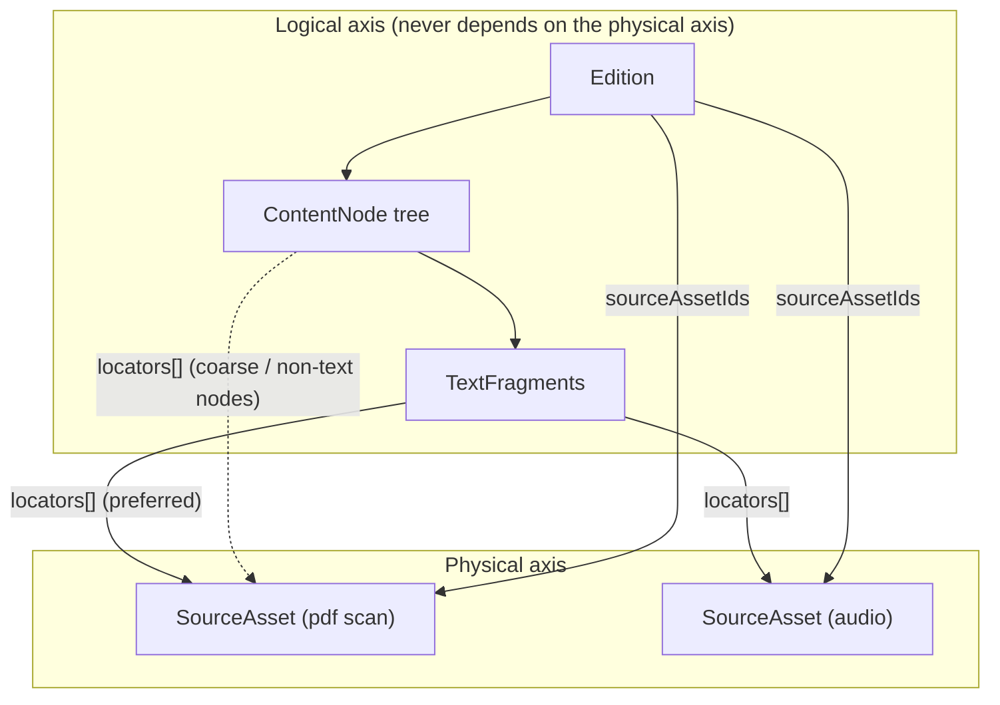
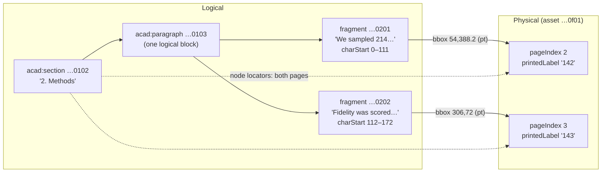
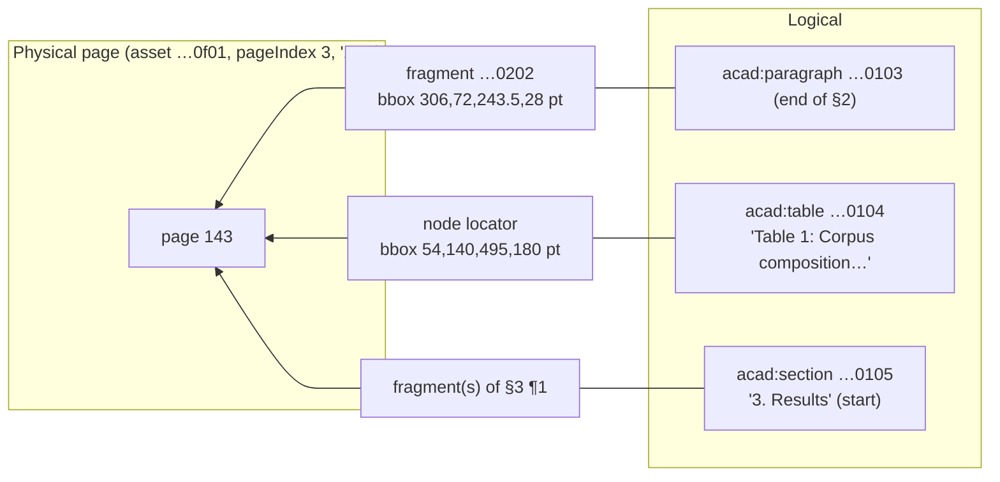

# 04 — Physical location: locators, fragments, and source assets

This document specifies how Context Fabric maps logical content back onto its physical carriers — PDF pages, EPUB anchors, OCR blocks, audio timecodes — without ever letting physical layout leak into logical structure. The instrument is the **PhysicalLocator**, an embeddable value object defined in [physical-locator.schema.json](../../../packages/common/src/common/schemas/context_fabric/v1/physical-locator.schema.json), attached to [TextFragments](../../../packages/common/src/common/schemas/context_fabric/v1/text-fragment.schema.json) (preferred) and [ContentNodes](../../../packages/common/src/common/schemas/context_fabric/v1/content-node.schema.json), and pointing into [SourceAssets](../../../packages/common/src/common/schemas/context_fabric/v1/source-asset.schema.json). Fragments are the join: a node that spans pages has multiple fragments with different page locators; a page that holds parts of several nodes holds fragments of different nodes locating to it.

See also: [README](README.md) · [01 — Domain model](01-domain-model.md) · [02 — Node taxonomy](02-node-taxonomy.md) · [03 — References](03-references.md) · [05 — API payloads](05-api-payloads.md) · [06 — Queries & storage](06-queries-and-storage.md) · [07 — Migration mapping](07-migration-mapping.md) · [08 — Invariants & versioning](08-invariants-and-versioning.md)

## 1. Two axes, deliberately separate

Logical structure (the ContentNode tree, ordered by `parentId` + `ordinal`) and physical location (locators into assets) are independent axes, and the dependency points one way only: **logical structure never depends on locators** (stated normatively in the [PhysicalLocator schema description](../../../packages/common/src/common/schemas/context_fabric/v1/physical-locator.schema.json)). Three reasons:

1. **Page-independent reading.** A reader consuming `monograph/chapter-4/section-2/paragraph-3` on a phone neither has nor wants the 1974 hardcover's page breaks. Rendering, navigation, search, and [reference resolution](03-references.md) all operate on the logical tree alone; a corpus with zero locators is fully functional.
2. **Multiple physical witnesses of one edition.** The same edition text may be backed by a born-digital EPUB *and* a page scan *and* an audio recording. Each is a separate SourceAsset; one fragment can carry one locator per asset (see the dual-located speech in §5). If pages were structural, each witness would force a different tree.
3. **Physical evidence is provenance, not content.** Locators answer "show me where this came from" — the scan region behind an OCR'd sentence, the seconds of tape behind an utterance. That is an audit/display concern, exactly like `provenance`, and is versioned the same way (§6).

The one sanctioned crossover is the **page-addressed work** (letters, some critical editions), where `phys:page` genuinely *is* the citation unit and enters the logical tree as a node — see §7.



## 2. PhysicalLocator field reference

From [physical-locator.schema.json](../../../packages/common/src/common/schemas/context_fabric/v1/physical-locator.schema.json). At least one of the six locating properties (`pageIndex`, `printedLabel`, `bbox`, `charStart`, `timeStart`, `sourceFragmentId`) is required; `unevaluatedProperties: false`.

| Field | Type | Semantics | Pitfalls |
|---|---|---|---|
| `sourceAssetId` | Id | The asset this locator points into. | Omit only when the edition has exactly one asset; with multiple witnesses it is effectively mandatory. |
| `pageIndex` | integer ≥ 0 | **0-based physical page index** in the asset (PDF page index, scan index). | This is NOT the printed number. In [letter-page.json](../../../packages/common/src/common/schemas/context_fabric/v1/examples/letter-page.json) the paragraph's locator has `pageIndex: 1, printedLabel: "2"` — the second physical scan page prints as "2". Never derive one from the other. |
| `printedLabel` | string | The page label **as printed** — `"23"`, `"xiv"`, `"B-4"`. | May be roman, alphanumeric, and non-unique (front matter often restarts numbering). Display and citation only; use `pageIndex` for machine addressing. |
| `bbox` | BBox | Rectangle on the page: `{x, y, width, height, unit}`, origin **top-left** ([common.defs](../../../packages/common/src/common/schemas/context_fabric/v1/common.defs.schema.json) `BBox`). | `unit` is `pt` (default), `px`, or `ratio`. `pt` boxes assume the asset page's own coordinate size; `px` boxes are tied to one rasterization DPI — record it in `ext` or prefer `ratio` (0–1 of page dimensions) for renderer independence. Meaningless without a page (`pageIndex`/`printedLabel`) alongside. |
| `charStart` | integer ≥ 0 | Start offset **in the asset's extracted text stream** (plaintext/HTML/XML sources). | This is a different coordinate space from `TextFragment.charStart` (§4). Offsets are only stable for the exact asset bytes pinned by `sha256` (§6); re-extraction invalidates them. |
| `charEnd` | integer ≥ 0 | End offset (exclusive) in the same stream. | Schema does not force `charEnd ≥ charStart`; writers must. |
| `timeStart` | number ≥ 0 | **Seconds** from the start of an audio/video asset. | Fractional seconds allowed (`21.4` in [speech.json](../../../packages/common/src/common/schemas/context_fabric/v1/examples/speech.json)). Not frames, not SMPTE. |
| `timeEnd` | number ≥ 0 | End time in seconds. | Same caveat as `charEnd`; cue boundaries from ASR are approximate — carry `confidence` on the fragment, not here. |
| `sourceFragmentId` | string | Source-native fragment id: EPUB/HTML anchor (`"jhn3.xhtml#v16"`), TEI `xml:id`, OCR block id, subtitle cue id (`"cue-4"`). | Only unique within its asset. Distinct from `ContentNode.sourceLocalId` (the *node's* id in the source) — a fragment locator can point at a finer unit than the node. |
| `ext` | Ext | Namespaced extension data (e.g. OCR engine details). | Round-tripped untouched; never required for interpretation. |

A maximal page locator, verbatim from the academic fixture (fragment `…0201`):

```json
{
  "sourceAssetId": "018f0003-0000-7000-8000-000000000f01",
  "pageIndex": 2,
  "printedLabel": "142",
  "bbox": { "x": 54.0, "y": 388.2, "width": 243.5, "height": 64.0, "unit": "pt" }
}
```

and a minimal anchor-only locator from [scripture-node.json](../../../packages/common/src/common/schemas/context_fabric/v1/examples/scripture-node.json) — an EPUB source has no pages, boxes, or timecodes, so the anchor alone satisfies the `anyOf`:

```json
{
  "sourceAssetId": "018f0000-0000-7000-8000-000000000f01",
  "sourceFragmentId": "jhn3.xhtml#v16"
}
```

**Writer validation rules** (beyond what JSON Schema can express):

1. `charEnd` requires `charStart` and must be ≥ it; likewise `timeEnd`/`timeStart`.
2. A `bbox` must be accompanied by a page (`pageIndex` and/or `printedLabel`) for paged assets.
3. `pageIndex` must be `< SourceAsset.pageCount` and `timeEnd` ≤ `SourceAsset.durationSeconds` when those hints are present.
4. Use coordinates appropriate to the asset kind: char offsets for text-stream assets, timecodes for `audio`/`video`, pages/bboxes for `pdf`/`image` — a time-coded locator into a PDF is a modeling error even though it validates.

## 3. The two hard cases

Both are taken directly from [academic-paper.json](../../../packages/common/src/common/schemas/context_fabric/v1/examples/academic-paper.json): a Methods section whose paragraph breaks across the page 142/143 boundary of a two-column PDF (asset `018f0003-0000-7000-8000-000000000f01`).

### 3a. One node spanning multiple pages

Paragraph node `018f0003-0000-7000-8000-000000000103` reads as one logical block, but physically lives on two pages. So it has **two fragments**, each with its own page locator; the parent section node `…0102` additionally carries both page locators as a coarse summary.



The break is invisible logically: `NodePayload.text` concatenates the fragments into the single sentence pair, and the fragments' `charStart`/`charEnd` (0–111, 112–172) tile the node's text. The section node's `locators` array (`pageIndex: 2, printedLabel: "142"` and `pageIndex: 3, printedLabel: "143"`) exists so a client can answer "what pages does §2 touch?" without loading fragments — exactly the pattern the ContentNode schema prescribes: "A node spanning pages carries one locator per page region; fragment-level locators are preferred when finer granularity exists."

### 3b. One page containing fragments of multiple nodes

Physical page `pageIndex: 3` (printed "143") holds: the tail of the Methods paragraph, Table 1, and (in the full document) the head of "3. Results" (nav item `…0105` in the fixture).



Inverting the locator index ("what is on page 143?") yields fragments and nodes belonging to *different* subtrees — the paragraph fragment `…0202`, the non-text-bearing table node `…0104` (located at node level with `bbox {x: 54.0, y: 140.0, width: 495.0, height: 180.0, unit: "pt"}`, since a figure/table has no fragments to carry the locator), and Results content. This is why the page cannot be a logical container here: it would have to split three nodes.

The inverted query is the basis for the two page-centric product features: **facsimile view** (render the scan of page 143 and overlay each located fragment's `bbox` as a clickable region into the logical reader) and **citation lookup** ("the reviewer cited p. 143 — what content is that?"). Both are pure index reads over `locators`; neither requires page nodes in the tree. Storage-side indexing of `(sourceAssetId, pageIndex)` → fragment/node is covered in [06 — Queries & storage](06-queries-and-storage.md).

## 4. TextFragment as the join

A [TextFragment](../../../packages/common/src/common/schemas/context_fabric/v1/text-fragment.schema.json) is a contiguous run of text belonging to exactly one node (`nodeId`, 0-based `ordinal` within the node, `text`, `after` separator). It carries **two independent coordinate systems**:

| Offsets | Coordinate space | Example (fixtures) |
|---|---|---|
| `TextFragment.charStart` / `charEnd` | The **node's concatenated plain text** (fragments' `text` + `after` in order). | academic paragraph: fragment `…0201` covers node chars 0–111, `…0202` covers 112–172. |
| `PhysicalLocator.charStart` / `charEnd` (inside `locators[]`) | The **source asset's extracted text stream**. | speech fragment `…0201` locates to chars 0–176 of the plaintext asset `…0f01`. |

They coincide only by accident (a single-fragment node parsed from offset 0). Conflating them is the most common integration bug: the first is stable under asset re-uploads, the second is pinned to one asset revision (§6).

**Where to attach locators — rules:**

1. **Prefer the fragment.** If the parser knows the page/bbox/timecode/anchor of a specific run of text, put the locator on that fragment (`TextFragment.locators`). All fixtures with fine-grained physical evidence do this.
2. **Node-level locators are summaries or fallbacks.** Use `ContentNode.locators` when (a) the node is non-text-bearing (the Table 1 node), (b) only coarse whole-node location is known (the letter paragraph node carries a page-only locator beside its fragment's page+bbox locator), or (c) you want cheap page-span answers without fragment loads (the §2 section node, case 3a).
3. **Never encode order in locators.** Reading order is `ordinal` under the node tree; locators may jump backwards physically (footnotes, two-column layouts) and that is fine.
4. **One locator per (asset, region).** A fragment witnessed by two assets gets two locators (§5), not one merged blob.

## 5. Timecoded media

Speeches and transcripts locate into audio/video assets with `timeStart`/`timeEnd` in seconds, optionally with the source cue id.

**Aligned recording — dual locators.** In [speech.json](../../../packages/common/src/common/schemas/context_fabric/v1/examples/speech.json), the Gettysburg Address ¶1 fragment `018f0004-0000-7000-8000-000000000201` carries two locators — one per witness:

```json
{
  "locators": [
    { "sourceAssetId": "018f0004-0000-7000-8000-000000000f01", "charStart": 0, "charEnd": 176 },
    { "sourceAssetId": "018f0004-0000-7000-8000-000000000f02", "timeStart": 0.0, "timeEnd": 21.4 }
  ]
}
```

Asset `…0f01` is the plaintext source (character stream), asset `…0f02` the audio recording (timecodes). A reader app can highlight the paragraph while playing seconds 0.0–21.4; a citation tool can quote by character range — same fragment, two physical projections.

**ASR/subtitle transcripts — cue ids.** In [transcript.json](../../../packages/common/src/common/schemas/context_fabric/v1/examples/transcript.json), each fragment of an utterance maps to one cue of the audio asset `018f0005-0000-7000-8000-000000000f01`. The respondent's utterance node `018f0005-0000-7000-8000-000000000102` (`transcript:utterance`, `refOrdinal: 2`) holds two fragments, one per cue:

```json
{
  "ordinal": 0,
  "text": "It started as three boxes of letters in the parish basement.",
  "after": " ",
  "confidence": 0.88,
  "locators": [
    {
      "sourceAssetId": "018f0005-0000-7000-8000-000000000f01",
      "timeStart": 17.3,
      "timeEnd": 21.0,
      "sourceFragmentId": "cue-5"
    }
  ]
}
```

with the second fragment on `cue-6` (`timeStart: 21.2, timeEnd: 23.8`, `confidence: 0.9`), and the interviewer's question on `cue-4` (12.8–16.9). Three things to note:

- `sourceFragmentId` preserves the cue identity so corrections can be traced back to the original VTT/ASR output even after text edits.
- Fragment-level `confidence` carries the recognizer's certainty per cue; the aggregate lands in `provenance.confidence` (0.89 for this node). Uncertainty is a fragment/provenance concern, never a locator field.
- The utterance node stays the logical citation unit (`transcript/utterance-2` in [references](03-references.md)); cue granularity remains purely physical. Splitting or merging cues on re-transcription changes fragments, not the utterance's identity or address.

## 6. Relation to SourceAsset

A [SourceAsset](../../../packages/common/src/common/schemas/context_fabric/v1/source-asset.schema.json) is an ingested input file or media object that an Edition was parsed from; PhysicalLocators point back into SourceAssets and nowhere else.

| Field | Type | Req. | Meaning |
|---|---|---|---|
| `schemaVersion` | SemVer | yes | Context Fabric schema version of the payload. |
| `id` | Id | yes | Opaque stable id (UUIDv7 recommended). What `locators[].sourceAssetId` points at. |
| `editionId` | Id | no | Owning edition, when the asset was ingested for one. |
| `sourceFormat` | enum | yes | `epub \| html \| xml \| tei \| pdf \| plain \| tf_zip \| tei_zip \| audio \| video \| image \| other` — superset of the parser `SourceFormat` enum in `admin.parsers.schema`. |
| `mediaType` | string | no | IANA media type (`application/epub+zip`, `audio/mpeg`). |
| `uri` | uri | no | Where the bytes live (storage URL, `hf://` path). |
| `filename` | string | no | Original filename. |
| `sha256` | `^[a-f0-9]{64}$` | no | Content hash pinning the exact bytes all locator coordinates are defined against. |
| `byteSize` | integer ≥ 0 | no | Size in bytes. |
| `pageCount` | integer ≥ 0 | no | Upper bound for `pageIndex` on paged media. |
| `durationSeconds` | number ≥ 0 | no | Upper bound for `timeEnd` on timed media. |
| `ext` | Ext | no | Namespaced extension data. |

**`sha256` pins the coordinate space.** Every locator coordinate — `pageIndex`, `bbox`, `charStart`, `timeStart` — is only meaningful against the exact bytes hashed into `SourceAsset.sha256`. A "small" re-export of a PDF can renumber pages and reflow every character offset.

**Re-upload semantics.** Assets are immutable. Uploading a corrected or re-scanned file creates a **new SourceAsset with a new id** (never an in-place mutation), and re-parsing against it produces a **new Edition revision** linked via `Relationship(kind: "supersedes")` — per the [Edition schema](../../../packages/common/src/common/schemas/context_fabric/v1/edition.schema.json): node ids are never mutated, `Edition.version` bumps, `supersedesEditionId` mirrors the edge. Consequently, **locators are immutable per edition revision**: the old revision's locators keep pointing at the old asset (still resolvable, still auditable), and the new revision's nodes/fragments carry fresh locators into the new asset. Nothing ever rewrites a stored locator to chase a moved file; `Edition.sourceAssetIds` and `provenance.sourceAssetId` say which assets a revision was cut from.

```mermaid
sequenceDiagram
    participant U as Curator
    participant S as Storage
    participant P as Parser (corpora-admin)

    U->>S: upload corrected scan.pdf
    S-->>U: SourceAsset id A2 (new UUID, new sha256)
    Note over S: A1 (old asset) untouched — E1's locators still valid
    U->>P: re-parse edition against A2
    P-->>S: Edition E2 (version bump), fresh nodes + fragments,<br/>locators → A2 only
    P-->>S: Relationship{kind: supersedes, from: E2, to: E1}
    Note over S: E1 + A1 remain queryable for audit/diff;<br/>clients follow supersedes to the current revision
```

Only URL rotation is exempt: `uri` may be refreshed when storage moves, because identity is `id` + `sha256`, not location.

## 7. Page-addressed works: when `phys:page` enters the logical tree

Pages are usually locator-only. The exception is a work whose *citation practice* is page-based — then pages are addresses, and addresses live in the logical tree.

**Decision rule.** Put `phys:page` nodes in the logical tree **iff** the page is a declared reference level — i.e. it appears in `Edition.structureProfile.levels` and readers cite the work by page of this witness. Then references through it are necessarily `kind: "edition"` ([doc 03 §5.4](03-references.md)), because page breaks belong to one physical realization. Otherwise — novels, EPUBs, any reflowable text — pages never become nodes; they appear only inside `locators`, and a different printing is just another asset.

| Signal | Page as logical node (`kind: edition` refs) | Page as locator only |
|---|---|---|
| How is the work cited? | "Letter, p. 2, ¶1"; archival folios; critical editions cited by page/line | "Chapter 4, ¶3"; chapter/verse; section numbers |
| Does structure survive reflow? | No — the page *is* the structure | Yes — paragraphs/chapters are page-independent |
| Multiple witnesses expected? | Each paged witness is its own edition | One edition, many assets |

**Tie-in: [letter-page.json](../../../packages/common/src/common/schemas/context_fabric/v1/examples/letter-page.json).** The 1863 letter is cited by page, so the scan edition (`editionSlug: "scan-1863"`) declares `phys:page` as a level: the breadcrumb shows a real node `018f0002-0000-7000-8000-000000000101` with `category: "milestone"`, `type: "phys:page"`, `refOrdinal: 2` — the `page-2` segment of the reference `letter/page-2/paragraph-1`. The paragraph node under it *still* carries a PhysicalLocator (`pageIndex: 1, printedLabel: "2"`, fragment bbox `{x: 96.0, y: 120.5, width: 402.0, height: 88.0, unit: "pt"}`) pointing into scan asset `…0f01`. The two mechanisms coexist and stay distinct: the **node** makes page 2 addressable (`refOrdinal: 2` — a 1-based canonical number), the **locator** records where on the physical scan the ink sits (`pageIndex: 1` — a 0-based asset coordinate). A future reading edition of the same letter can drop the page nodes entirely and remain a valid edition of the same work.

## Summary of invariants

1. Logical structure never depends on locators; a corpus with zero locators is fully valid.
2. At least one locating property per locator (schema `anyOf`); coordinates match the asset kind.
3. `pageIndex` is 0-based physical; `printedLabel` is as-printed and possibly non-unique; never derive one from the other.
4. Fragment locators are preferred; node locators are summaries or carriers for non-text nodes.
5. Locator coordinates are pinned to `SourceAsset.sha256`; re-upload means new asset id, re-parse means new edition revision — locators are immutable per revision.
6. `phys:page` enters the logical tree only when the page is a declared reference level, and then references through it are `kind: "edition"`.
