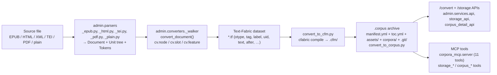

# 07 — Migration Mapping: Today's Pipeline → the Canonical Content Graph

This document grounds the Context Fabric v1 model in the code that exists today: it maps every
field of the current `Document`/`Unit` parser schema, the shared Text-Fabric walker, and the
`.corpus` archive onto the canonical entities defined by the
[v1 JSON Schemas](../../../packages/common/src/common/schemas/context_fabric/v1/), names the
concrete gaps the canonical model closes, and lays out a phased adoption plan that never rips out
the Text-Fabric runtime.

See also: [README.md](README.md) · [01-domain-model.md](01-domain-model.md) ·
[02-node-taxonomy.md](02-node-taxonomy.md) · [03-references.md](03-references.md) ·
[04-physical-location.md](04-physical-location.md) · [05-api-payloads.md](05-api-payloads.md) ·
[06-queries-and-storage.md](06-queries-and-storage.md) ·
[08-invariants-and-versioning.md](08-invariants-and-versioning.md)

## 1. Current pipeline recap

One shared schema, one shared walker: every format parser in
`packages/admin/src/admin/parsers/` reduces its source to the same `Document` (metadata) +
recursive `Unit` tree (`packages/admin/src/admin/parsers/schema.py`), and one Text-Fabric walk
(`packages/admin/src/admin/converters/_walker.py`) turns that tree into a TF dataset regardless of
format.



Key facts about the current output that drive the mapping below:

- The walker declares **one** TF section level: `otext.sectionTypes` is the root type
  (`book`/`document`/`text`), `sectionFeatures` is `title`, and the slot type is `word` with
  `text`/`after` features (`_walker.py`, `cv.walk(...)` call).
- Each `Unit` becomes a TF node of the type chosen by the converter's `otype_for()` and carries
  features `tag` (= `Unit.type`), `label`, `uid` (= `Unit.id`), plus every key of `Unit.attrs`.
- `convert_to_corpus.py` packages the dataset with a `manifest.yml` (`ICorpusManifest`) and a
  `toc.yml` (`ICorpusToc`) built by introspecting the compiled corpus.
- `admin.services.corpus_detail` serves stored archives back as
  `{ref, format, passages: [{ref, text}], total, offset, limit, next_offset}` and resolves refs
  with a string-match fallback (see §3).

## 2. Mapping tables

Conventions used throughout: every canonical entity gets a **newly minted UUIDv7 `id`**
(existing pipeline identifiers become `sourceLocalId` or land in `ext`, never the primary id);
everything source-specific that has no canonical field goes losslessly into
`ext["src/<format>"]`.

### 2a. `Unit` → [`ContentNode`](../../../packages/common/src/common/schemas/context_fabric/v1/content-node.schema.json)

| `Unit` field (`parsers/schema.py`) | ContentNode field | Rule |
|---|---|---|
| — | `id` | Mint UUIDv7 at conversion time. MUST NOT be derived from source ids. |
| — | `editionId` | The Edition minted for this conversion run (§2d). |
| `type` (free string: `"chapter"`, `"p"`, `"div"`, `"page"`, …) | `type` + `category` | Looked up in the **per-format alias table** ([02-node-taxonomy.md](02-node-taxonomy.md)): e.g. epub `"chapter"` → `generic:chapter`/`division`; unknown values → `generic:<slug>` with a best-effort category (default `block` for token-bearing units, `division` for container-only units). |
| `id` | `sourceLocalId` | Verbatim (EPUB anchor, TEI `xml:id`, HTML `id`). Also usable as `PhysicalLocator.sourceFragmentId`. |
| `label` | `label` | Verbatim. Display only — never a resolution input. |
| `attrs` (dict[str, str]) | `ext["src/<format>"]` | Whole dict, byte-for-byte. Selected attrs MAY additionally be lifted to canonical fields (e.g. TEI `@type`, `@xml:lang` → `language`) without removing them from `ext`. |
| nesting (`children` position) | `parentId`, `ordinal`, `depth` | `parentId` = parent node's minted id; `ordinal` = 0-based index in `children`; `depth` = tree depth (root = 0). `childCount` = `len(children)`. |
| `tokens` | — (see §2b) | Tokens never become nodes; they become TextFragment text. |

### 2b. `Token` / TF slots → [`TextFragment`](../../../packages/common/src/common/schemas/context_fabric/v1/text-fragment.schema.json)

Today a `Unit`'s `tokens: list[Token]` become one `cv.slot()` per token with `text`/`after`
features. Canonically, **contiguous token runs concatenate into fragments**:

| Today | TextFragment | Rule |
|---|---|---|
| A `Unit`'s uninterrupted token run | one fragment | `fragment.text` = `"".join(t.text + t.after for t in run)` minus the final `after`, which becomes `fragment.after` (mirrors TF's `after` convention, per the schema's own description). |
| Token run split by a physical boundary (page break, timecode cue) | one fragment per side | Each fragment carries its own `locators[]`; the node stays whole (see [04-physical-location.md](04-physical-location.md)). |
| slot position within the node | `ordinal` | 0-based per node. |
| — | `charStart` / `charEnd` | Computed offsets into the node's concatenated plain text; `charStart` of fragment *n+1* = `charEnd` of *n* plus the length of *n*'s `after`. |
| TF slot range (`oslots`) of a node | fragment boundaries | A node's TF slot range ↔ the union of its fragments' text; converting back to TF, fragments re-tokenize via `parsers.schema.tokenize()`. |
| `_walker._walk_unit` placeholder empty slot (empty leaf survival hack) | **no fragment** | Canonical non-text-bearing nodes simply have zero fragments — the placeholder-slot workaround disappears. |

### 2c. Walker features → node fields

Per-node features set by `_walker._unit_features()`:

| TF feature | Canonical field |
|---|---|
| `tag` (= `Unit.type`) | `ContentNode.type` (via alias table, §2a) |
| `label` | `ContentNode.label` |
| `uid` (= `Unit.id`) | `ContentNode.sourceLocalId` |
| any `Unit.attrs` key | `ContentNode.ext["src/<format>"]` |

Root-node metadata features set by `_walker.metadata_features()` (flattened from
`DocumentMetadata`):

| Root TF feature | Built as | Canonical destination |
|---|---|---|
| `title` | `metadata.title or "Untitled"` | `Work.title` / `Edition.title` |
| `source_format` | `metadata.source_format.value` | `SourceAsset.sourceFormat` |
| `creators` | `"; ".join(metadata.creators)` | `Work.creators[]` (structured `{name, role}`; the join is undone — the list source survives, the joined string does not) |
| `language` | verbatim | `Edition.language` (normalized to BCP 47) |
| `publisher` | verbatim | `Edition.publisher` |
| `date` | verbatim | `Edition.date` (free-form) |
| `description` | verbatim | `Corpus.description` or `Work` `ext` |
| `identifier` | verbatim | `Work.ext["src/<format>"]` |
| `rights` | verbatim | `Edition.rights` |
| `subjects` | `"; ".join(metadata.subjects)` | `Work.ext["src/<format>"].subjects` (list form) |
| every `metadata.extra` key | verbatim | `ext["src/<format>"]` on Work or Edition |

### 2d. `DocumentMetadata` → Work + Edition + SourceAsset split

One parse produces one [`Work`](../../../packages/common/src/common/schemas/context_fabric/v1/work.schema.json),
one [`Edition`](../../../packages/common/src/common/schemas/context_fabric/v1/edition.schema.json), and one
[`SourceAsset`](../../../packages/common/src/common/schemas/context_fabric/v1/source-asset.schema.json):

| `DocumentMetadata` field | Lands on | Notes |
|---|---|---|
| `title` | `Work.title` and `Edition.title` | Same string initially; they diverge once multiple editions exist. |
| `creators` | `Work.creators[]` | `role` defaults to `"author"`. |
| `language` | `Edition.language` | A Work has `originalLanguage` only when known. |
| `publisher`, `date`, `rights` | `Edition` | Publication facts are edition-level. |
| `description` | `Work.ext` / `Corpus.description` | No canonical Work description field in v1. |
| `identifier`, `subjects` | `Work.ext["src/<format>"]` | Lossless. |
| `source_format` | `SourceAsset.sourceFormat` | The asset enum is a declared **superset** of `parsers.schema.SourceFormat` (adds `audio`/`video`/`image`/`other`). |
| `extra` | `ext["src/<format>"]` | Whole dict. |
| — (file facts: name, bytes, sha256, page count) | `SourceAsset.filename/byteSize/sha256/pageCount` | Captured at `POST /convert` upload time. |
| — | `Edition.provenance` | `{parser: {name: "corpora-admin", version: <package version>, profile: <format>}, convertedAt, sourceAssetId}`. |

### 2e. `ICorpusManifest` / `toc.yml` → Corpus/Edition

From `convert_to_corpus._build_manifest()`:

| Manifest key | Canonical destination |
|---|---|
| `uid` | `ext["corpus/manifest"].uid` — canonical ids are minted fresh; the manifest uid is preserved for round-trip, not reused as `Corpus.id`. |
| `name` | `Corpus.title` (and `Corpus.slug` via slugification) |
| `description` | `Corpus.description` |
| `version` | `Edition.version` |
| `language` / `languageCode` | `Corpus.languages[]` / `Edition.language` (`languageCode` is the BCP 47 source of truth; `language` is display) |
| `type`, `category` | `Work.genre` (informative free-form) |
| `written_date` | `Work.date` |
| `format` (`"corpus"`), `format_version` (`"1"`) | not mapped — properties of the archive container, not the content graph |
| `tocFile`, `assets`, `thumbnail` | archive concerns; images become `SourceAsset`s (`sourceFormat: "image"`) when referenced |
| `datasetId`, `projectId`, `publisherId`, `authorId` (toc) | `ext["corpus/manifest"]` — backend-assigned opaque ids |

`toc.yml` (`_build_toc()`: `has_sections`, `has_features`, `has_nodes`, `files[]`, size totals) is
**derived data, not canonical**: everything in it is recomputable from the content graph
(`has_sections` ⇢ `Edition.structureProfile` non-empty; `files` ⇢ storage listing). It maps to
nothing and MUST NOT be treated as a source of truth during migration.

### 2f. Per-format otype → taxonomy

Rows name the converter module and every TF node type it emits today:

| Format (converter) | TF otype | category | type | Notes |
|---|---|---|---|---|
| epub (`_epub_to_tf.py`) | `book` (root) | `root` | `generic:book` | Carries metadata features. |
| | `chapter` | `division` | `generic:chapter` | |
| | `paragraph` (`p`, `blockquote`) | `block` | `generic:paragraph` (`generic:blockquote` via `ext` tag) | |
| | `link` (`a`) | `inline` | `generic:link` | `href` stays in `ext["src/epub"]`. |
| | `element` | `block` or `inline` per alias table | `generic:<tag>` | Original tag survives as `ext["src/epub"].tag`. |
| pdf (`_pdf_to_tf.py`) | `book` (root) | `root` | `generic:book` | |
| | `page` | `milestone` | `phys:page` | **Decision:** the `page_number` feature becomes `PhysicalLocator.pageIndex` (0-based; `page_number` is 1-based, so `pageIndex = page_number - 1`) on the node/fragments, and the page node itself is typed `phys:page` — pages are physical milestones, not logical divisions. |
| tei (`_tei_to_tf.py`) | `text` (root) | `root` | `tei:text` | |
| | `div` | `division` | `tei:div` | TEI `@type` (e.g. `div type="chapter"`) refines via the tei alias table (`tei:div[chapter]` → `generic:chapter` semantics) and survives in `ext["tei"]`. |
| | `paragraph` (`p`) | `block` | `tei:p` | |
| | `element` | per alias table | `tei:<element>` | |
| html (`_html_to_tf.py`) | `document` (root) | `root` | `generic:document` | |
| | `element` | per alias table (`p`→`block`, `span`/`a`→`inline`, `table`→`table`, `img`→`figure`, …) | `generic:<tag>` | HTML collapses everything to `element` today; the original tag (`tag` feature) is what the alias table keys on. |
| plain (`_text_to_tf.py`) | `book` (root) | `root` | `generic:book` | |
| | `paragraph` | `block` | `generic:paragraph` | |

(`_tei_zip_to_tf.py` / `_tf_zip_to_tf.py` reuse the tei/identity mappings; a multi-document ZIP
becomes multiple Works/Editions under one Corpus.)

### 2g. Worked example: one EPUB paragraph, before and after

Today, `EpubParser` yields (abridged):

```json
{
  "type": "p",
  "id": "jhn3-v16",
  "label": null,
  "attrs": { "class": "verse", "epub:type": "verse" },
  "tokens": [
    { "text": "For", "after": " " },
    { "text": "God", "after": " " },
    { "text": "so", "after": " " },
    { "text": "loved…", "after": "" }
  ],
  "children": []
}
```

The walker turns this into a TF `paragraph` node with features
`tag="p"`, `uid="jhn3-v16"`, `class="verse"`, `epub:type="verse"` over four `word` slots.
Canonically (matching the CI fixture
[examples/scripture-node.json](../../../packages/common/src/common/schemas/context_fabric/v1/examples/scripture-node.json)),
the same unit becomes one node + one fragment:

```json
{
  "id": "<minted UUIDv7>",
  "editionId": "<edition UUIDv7>",
  "parentId": "<chapter node id>",
  "ordinal": 15,
  "category": "block",
  "type": "bible:verse",
  "refOrdinal": 16,
  "sourceLocalId": "jhn3-v16",
  "ext": { "src/epub": { "class": "verse", "epub:type": "verse" } }
}
```

with `fragment = {nodeId, ordinal: 0, text: "For God so loved…", after: "", charStart: 0,
charEnd: …}`. Note the promotion `"p"` → `bible:verse`/`block` runs through the epub alias table
*refined by the `epub:type="verse"` attribute* — exactly the kind of format-specific rule the
alias registries of [02-node-taxonomy.md](02-node-taxonomy.md) exist to hold, instead of being
hard-coded in `otype_for()`.

## 3. Gaps this closes

1. **Single declared section level.** `_walker.py` sets `otext.sectionTypes = root_type` only, so
   `T.nodeFromSection(("John", 3, 16))` cannot resolve anything deeper than the document title —
   deep refs structurally fail. Canonically, `Edition.structureProfile.levels` declares the full
   reference hierarchy (`bible:book` / `bible:chapter` / `bible:verse`), and Phase 2 feeds it back
   into the walker as multi-level `sectionTypes`.
2. **The string-match fallback.** `corpus_detail._resolve_section_node()` falls back to comparing
   the request string against `T.sectionFromNode()` output for every candidate node — an O(nodes)
   scan that only works because the index emitted the exact same string. Canonical
   [`Reference`](../../../packages/common/src/common/schemas/context_fabric/v1/reference.schema.json)
   resolution uses typed segments (code/ordinal) matched against `code`/`refOrdinal` columns —
   label-independent, indexable, and with explicit `ResolveResponse.status` instead of a bare 404.
3. **Free-form `Unit.type` vocabulary drift.** `Unit.type` is deliberately a free string, and each
   converter's `otype_for()` collapses it differently (`"blockquote"` → `paragraph` in epub,
   `element` in html). The closed `category` enum + namespaced `type` + per-format alias tables
   ([02-node-taxonomy.md](02-node-taxonomy.md)) make the vocabulary explicit and reviewable while
   keeping it open.
4. **`passages: [{ref, text}]` payloads carry nothing else.** `corpus_detail.get_content()` returns
   ref strings and flat text — no stable ids, no types, no hierarchy, no provenance, no physical
   locators. Clients like `example/app/lib/corpus-detail.ts` must re-parse ref strings to infer
   structure. `NodePayload` / `RangeResponse`
   ([api-payloads.schema.json](../../../packages/common/src/common/schemas/context_fabric/v1/api-payloads.schema.json))
   replace this with full nodes: ids, `category`/`type`, fragments with offsets and locators,
   breadcrumbs, prev/next, and a structured `ref`.

## 4. Phased adoption plan

| Phase | Scope | Touched modules | Compat risk |
|---|---|---|---|
| **1 — NOW (done)** | Schemas as the documentation contract; six CI-validated fixtures. | `packages/common/src/common/schemas/context_fabric/v1/` + [tests/common/test_context_fabric_schemas.py](../../../tests/common/test_context_fabric_schemas.py) (exists and runs in CI). No runtime code changes. | None. |
| **2 — Canonical emission** | Converters emit canonical JSON (`nodes.jsonl` + `fragments.jsonl`, or a single `graph.json` for small corpora) **alongside** the TF dataset inside the `.corpus` archive; `_walker.convert_documents()` gains multi-level `otext.sectionTypes` derived from a per-format default `structureProfile`. | `admin/converters/_walker.py`, each `_{format}_to_tf.py`, `convert_to_corpus.py` (new archive members; manifest/toc untouched). | Low: purely additive archive members; TF sectionTypes widening is validated per format before enabling (TF sections require strict nesting — formats that can't guarantee it keep the single level). |
| **3 — Canonical serving** | `/storage/{filename}/…` detail routes and `corpus_*` MCP tools grow **parallel** canonical endpoints returning `NodeResponse`/`RangeResponse`/`ResolveResponse` envelopes; old `{ref, format, passages}` shapes are **deprecated, not broken**. `example/app/lib/corpus-detail.ts` migrates to the new envelopes. | `admin/services/corpus_detail.py`, `corpus_detail_api.py`, `corpus_detail_mcp.py`; client: `example/app/lib/corpus-detail.ts` (+ its test). | Medium: two shapes served side by side for one deprecation window (§5, and [08-invariants-and-versioning.md](08-invariants-and-versioning.md) §6). |
| **4 — Optional materialization** | Load `nodes.jsonl`/`fragments.jsonl` into Postgres/Supabase per the ltree + `parent_id` design of [06-queries-and-storage.md](06-queries-and-storage.md), for deployments that need cross-corpus SQL. The sidecar keeps serving from TF regardless. | New ingestion job (admin.services); DDL from doc 06. | Low for existing users: opt-in; the TF path remains the default runtime. |

Each phase MUST keep `uv run pytest` green, and Phase ≥2 MUST validate emitted JSON against the
shipped schemas at conversion time (the schemas are packaged inside `corpora-common` precisely so
converters can do this offline).

## 5. Explicit non-goals

- **No Text-Fabric rip-out.** The TF sidecar (`corpora_mcp.corpus`, `cfabric`) remains the runtime
  query engine; the canonical graph is an interchange and serving contract layered over it.
- **`.corpus` format v1 stays readable.** Existing archives (manifest.yml / toc.yml / corpora/)
  MUST continue to load in every phase; canonical files are added, nothing is removed or renamed.
- **Existing MCP tool names stay.** The 11 `corpora_mcp.server` tools and the
  `storage_*`/`corpus_*` tools keep their names and current response shapes through the
  deprecation window; canonical envelopes arrive as new tools/params, not renames.
