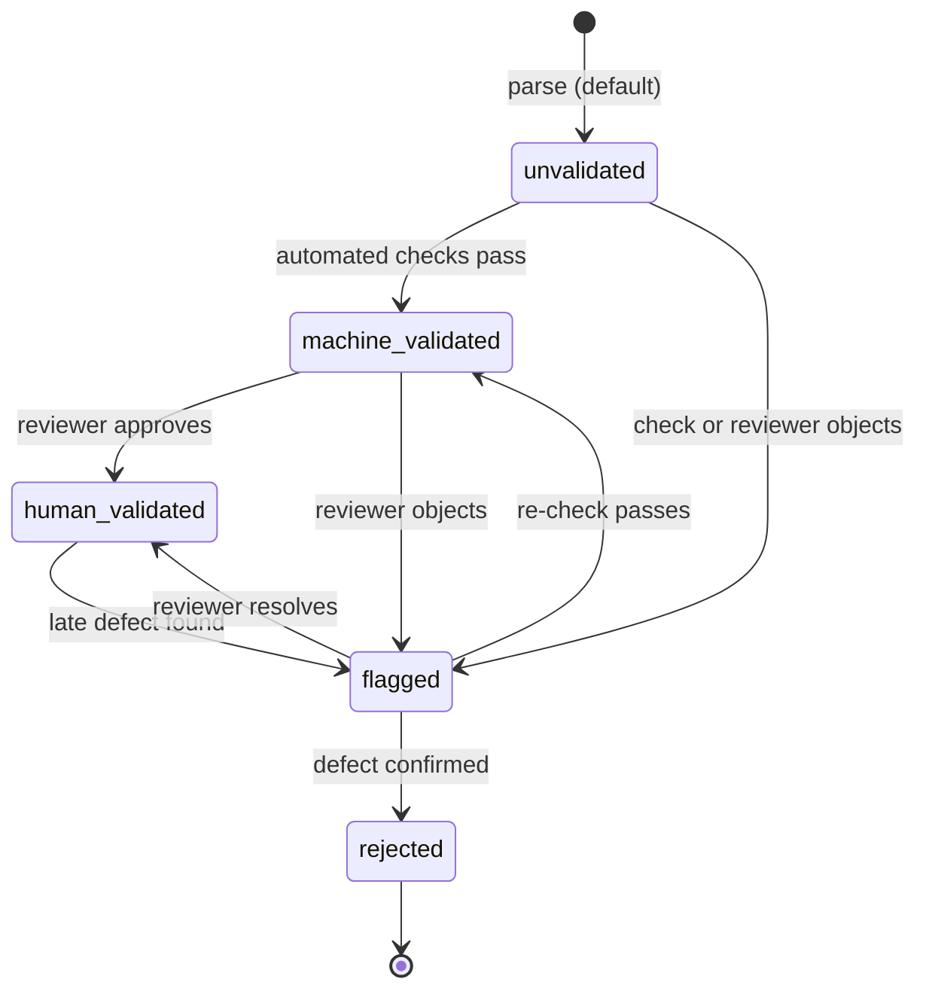

# 08 — Invariants, Failure Semantics, and Versioning

This document is the normative rulebook for Context Fabric v1 (spec item K): the structural
invariants every conforming producer and store MUST uphold, the defined behavior for every
failure case, and the versioning contracts — schema, parser, and data — that let clients and
servers evolve independently without breaking each other. Where a rule is enforceable by the
[machine-readable schemas](../../../packages/common/src/common/schemas/context_fabric/v1/common.defs.schema.json), the
schema is the enforcement point; everything else names the service or database layer responsible.

See also: [README.md](README.md) · [01-domain-model.md](01-domain-model.md) ·
[02-node-taxonomy.md](02-node-taxonomy.md) · [03-references.md](03-references.md) ·
[04-physical-location.md](04-physical-location.md) · [05-api-payloads.md](05-api-payloads.md) ·
[06-queries-and-storage.md](06-queries-and-storage.md) ·
[07-migration-mapping.md](07-migration-mapping.md)

## 1. Invariants

Each invariant states its rationale and its enforcement point: **schema** (JSON Schema, checkable
per document), **service** (ingest/serve code — the only layer that sees whole editions today),
or **DB** (a constraint once Postgres materialization per
[06-queries-and-storage.md](06-queries-and-storage.md) exists).

**I1 — Exactly one root per Edition.** Every Edition has exactly one ContentNode with
`parentId: null`; every other node's `parentId` MUST resolve to a node **in the same edition**.
*Rationale:* a single root makes traversal, breadcrumbs, and `depth` well-defined; cross-edition
parents would make an edition non-self-contained and break supersession (I8).
*Enforcement:* service at ingest (schema can only check the field shape — see
[content-node.schema.json](../../../packages/common/src/common/schemas/context_fabric/v1/content-node.schema.json));
DB: `UNIQUE (edition_id) WHERE parent_id IS NULL` partial index + FK `(parent_id) REFERENCES
content_node(id)` with an edition-match trigger.

**I2 — Acyclic parent chain.** Following `parentId` from any node MUST terminate at the root in
finitely many steps.
*Rationale:* cycles make every traversal, `depth`, and materialized path undefined.
*Enforcement:* service at ingest (walk-up check or topological insert order); DB: the ltree path
rebuild (I9) fails loudly on a cycle.

**I3 — Ordinals unique per parent; gaps allowed.** `ordinal` MUST be unique among siblings
(same `parentId`); it SHOULD start at 0 and be contiguous at initial ingest, but **gaps are
permitted afterwards**. We choose *unique-with-gaps* over *always-contiguous* deliberately:
corrections that reject a node (validationState `rejected`) or future partial re-ingests must not
force renumbering every following sibling — renumbering rewrites rows whose content didn't change,
inflates correction history, and races with concurrent readers. Document order is defined by
*sorting* on `ordinal`, which gaps don't disturb.
*Enforcement:* DB `UNIQUE (parent_id, ordinal)`; service ingest asserts uniqueness; schema only
enforces `minimum: 0`.

**I4 — Fragments belong to exactly one node; fragment ordinals unique per node.** A
[TextFragment](../../../packages/common/src/common/schemas/context_fabric/v1/text-fragment.schema.json)
has exactly one `nodeId` (schema: required, single-valued), and `(nodeId, ordinal)` is unique.
Node text is exactly the concatenation of its fragments' `text + after` in `ordinal` order.
*Rationale:* the fragment is the logical↔physical join; shared fragments would make character
offsets and locators ambiguous.
*Enforcement:* schema (shape) + DB `UNIQUE (node_id, ordinal)`.

**I5 — `category` and `type` meanings are stable within a major; node `type` is immutable after
ingest.** The `category` enum is frozen for the life of `/v1/` ([02-node-taxonomy.md](02-node-taxonomy.md));
a registered `type`'s semantics never change (register a new name instead). A node's `type` MUST
NOT be edited post-ingest: corrections change *content* (fragment text, labels, ext), never
*identity*. Getting the type wrong is a parse error — the remedy is a new edition revision (I8).
*Enforcement:* schema (enum) for `category`; service rejects PATCHes touching `type`; taxonomy
registry review for meaning changes.

**I6 — Reference addresses unique among siblings-at-level.** Within one `(edition, levelType)`,
the `refOrdinal` (ordinal-addressed levels) or `code` (code-addressed levels) of nodes sharing the
same parent-at-that-level MUST be unique — `bible/JHN/3` must name at most one chapter node.
Uniqueness is per sibling group, not global: verse 16 exists in every chapter.
*Rationale:* [Reference](../../../packages/common/src/common/schemas/context_fabric/v1/reference.schema.json)
resolution must be deterministic; duplicates downgrade `ResolveResponse.status` to `ambiguous`
(§2), which is a data defect, not a resolver feature.
*Enforcement:* service at ingest (validates against `Edition.structureProfile`); DB partial unique
indexes per level type.

**I7 — `ext` is round-tripped byte-for-byte; servers never interpret unknown namespaces.** Any
store or API that accepts an entity MUST return its `ext` unchanged (key order aside — JSON object
order is not significant) and MUST NOT branch on namespaces it does not own.
*Rationale:* `ext` is the single lossless extension point; the moment a server "helpfully"
normalizes vendor data, round-trip and forward-compatibility die.
*Enforcement:* schema (namespaced key pattern in
[common.defs.schema.json](../../../packages/common/src/common/schemas/context_fabric/v1/common.defs.schema.json)
`$defs/Ext`); service contract tests (store → read → deep-equal).

**I8 — Ids are immutable and never reused; re-parse = new Edition.** A minted UUIDv7 id names its
entity forever. Re-running a parser (new parser version, corrected source) produces a **new
Edition** with all-new node/fragment ids, linked by `Relationship(kind: "supersedes")` and
`Edition.supersedesEditionId`; nodes of the old edition are never mutated or deleted in place.
*Rationale:* stable ids are the only identity carrier (labels and refs are explicitly not);
annotations, bookmarks, and caches in client apps depend on them.
*Enforcement:* service (ingest only ever inserts nodes; no node-level UPDATE of structural
fields); DB primary keys; UUIDv7 makes accidental reuse statistically impossible.

**I9 — Materialized `path` is derivable and idempotently rebuildable.** When the ltree `path` of
[06-queries-and-storage.md](06-queries-and-storage.md) is materialized, it MUST be a pure function
of `(parent_id, ordinal)` recursion — rebuilding paths from scratch MUST yield byte-identical
values (idempotent), and any divergence between stored and recomputed paths is corruption.
*Rationale:* `path` is an index, not a source of truth; if it can drift from the parent chain,
queries silently return wrong subtrees.
*Enforcement:* DB rebuild job + verification query (recompute vs. stored); service never writes
`path` except via the rebuild routine.

### Enforcement matrix

| Invariant | Schema | Service | DB (Phase 4) |
| --- | --- | --- | --- |
| I1 one root, same-edition parents | shape only | ✔ ingest | ✔ partial unique index + trigger |
| I2 acyclic | — | ✔ ingest | ✔ path rebuild fails |
| I3 ordinal unique per parent | `minimum: 0` | ✔ ingest | ✔ `UNIQUE (parent_id, ordinal)` |
| I4 fragment ownership + ordinals | ✔ shape | ✔ ingest | ✔ `UNIQUE (node_id, ordinal)` |
| I5 frozen category, immutable type | ✔ enum | ✔ PATCH guard | ✔ column immutability trigger |
| I6 sibling-level ref uniqueness | — | ✔ ingest vs. structureProfile | ✔ partial unique indexes |
| I7 ext round-trip | ✔ key pattern | ✔ contract tests | n/a (opaque jsonb) |
| I8 immutable ids, edition supersession | `format: uuid` | ✔ insert-only ingest | ✔ PKs, no UPDATE path |
| I9 idempotent path rebuild | — | ✔ rebuild routine | ✔ verify query |

The schema column shows why the schemas alone are necessary but not sufficient: they validate one
document at a time, while I1–I3, I6, and I9 are *relational* properties of a whole edition. Until
Postgres materialization exists, the service ingest step is the sole cross-entity enforcement
point — which is precisely why F9 requires job-scoped atomicity there.

## 2. Failure cases

Defined behavior for every anticipated failure. "Envelope" refers to
[api-payloads.schema.json](../../../packages/common/src/common/schemas/context_fabric/v1/api-payloads.schema.json).

| # | Failure | Required behavior |
| --- | --- | --- |
| F1 | **Malformed reference string** (unparseable per the grammar of [03-references.md](03-references.md)) | HTTP 400 / `ResolveResponse` with `status: "not_found"`, `reference: null`, empty `matches`, and the raw `input` echoed. Never guess. |
| F2 | **Well-formed but unresolvable reference** (verse 200 of a 36-verse chapter) | `ResolveResponse.status: "not_found"` (nothing matched) or `"partial"` (a prefix of the segments resolved — return the deepest resolved node in `matches`). Multiple I6-violating candidates → `"ambiguous"` with all candidates listed. |
| F3 | **Unknown `category`** | **Reject** (schema validation error at ingest; 422 at the API). The enum is closed and frozen per major — an unknown category means the payload is from a different major. |
| F4 | **Unknown `type`** | **Accept** (pattern-valid namespaced string). Servers store and serve it; clients degrade to rendering by `category` ([02-node-taxonomy.md](02-node-taxonomy.md)). |
| F5 | **Fragment/node offset inconsistency** (`charStart`/`charEnd` don't tile the concatenated text, `charEnd < charStart`, overlapping ranges) | Ingest: reject the edition (I4 violation). Serving pre-existing bad data: serve, but flag `provenance.validationState: "flagged"` and omit the offsets rather than serve wrong ones. |
| F6 | **Locator points at a missing SourceAsset** (`sourceAssetId` dangles) | Not an error for text serving — logical structure never depends on locators. Serve the node; asset-fetch endpoints return 404; integrity checkers flag the edition. |
| F7 | **Correction targets a nonexistent path** (`Correction.path` JSON Pointer resolves to nothing) | Reject the correction write (422). Never append a correction whose `path` can't be resolved at write time — the audit trail (§5) must stay replayable. |
| F8 | **Read against a superseded edition** | **Still served**, marked: responses include the edition's `supersedesEditionId` chain info and SHOULD include a successor pointer (the inverse `supersedes` Relationship). Old ids never 404 because something newer exists (I8). |
| F9 | **Partial ingest crash** (converter/importer dies mid-edition) | Job-scoped atomicity: an edition becomes visible **only when complete**. Ingest writes under a job id (the `/convert` `JobManager` pattern) and flips visibility last (DB: single transaction or a `visible_at` flip; files: write `nodes.jsonl` to a temp name, rename last). A crashed job leaves no partially readable edition — clients can never observe a tree that violates I1/I2. |

## 3. Migration rules

- **Additive-only within a major.** Any change to `/v1/` schemas may only add optional fields,
  add `$defs`, or widen open sets (§4). No field removal, no type narrowing, no new `required`
  entries, no semantics changes to existing fields.
- **Field deprecation policy — three stages, one gate each:**
  1. *Deprecated in docs:* the field's description gains `DEPRECATED:` + replacement; servers keep
     emitting it. (Any MINOR.)
  2. *Ignored:* servers stop reading it on input but still emit it for old clients. (A later
     MINOR, at least one release after stage 1.)
  3. *Removed:* only at the **next major** (`/v2/`).
- **Data migrations are new edition revisions.** Reshaping already-ingested content (re-running an
  improved parser, re-chunking fragments, fixing a wrong hierarchy) is expressed as a new Edition
  - `Relationship(supersedes)` per I8 — never as in-place rewriting of an existing edition's
  nodes. Bulk backfills that add *optional* fields (e.g. computing missing `charStart`) are the
  one exception: they may update rows in place because they change no identity and no existing
  value, and each touched entity records a `corrections[]` entry.
- **ltree relabeling is versioned.** If the label alphabet or path-segment encoding of the
  materialized ltree changes (doc 06), that is a *storage-schema* migration: run the idempotent
  rebuild (I9) inside one migration transaction, bump a `path_encoding` marker in the storage
  metadata table, and never mix encodings within one database. Canonical entities are untouched —
  `path` is derived data.

## 4. Schema versioning

Payloads carry `schemaVersion` (semver) and the schemas carry the major in their `$id`
(`https://schemas.exegia.co/context-fabric/v1/…`). The two MUST agree on the major.

A **MINOR** version MAY:

- add optional properties to any entity;
- add new `$defs` (including new response envelopes in `api-payloads.schema.json`);
- add enum values **only to open sets** — e.g. `SourceAsset.sourceFormat`, well-known
  `Relationship.kind` strings, new registered `type` names (which are pattern-validated, not
  enumerated);
- relax a constraint (widen a `maxLength`, drop a `minItems`) when no conforming document becomes
  invalid.

A MINOR (or PATCH) MUST NOT:

- add `required` fields or remove/rename any field;
- add, remove, or re-mean `NodeCategory` values (closed, frozen per major — F3);
- change `ValidationState`, `Reference.kind`, `ResolveResponse.status`, or any other closed enum;
- change the *semantics* of an existing field, even shape-compatibly.

Anything on the MUST-NOT list is a **v2**: a new `/v2/` schema directory published side-by-side,
with `/v1/` still served and validated for the entire v1 support window. Servers MAY serve both
majors simultaneously (negotiated by route or by `schemaVersion`); they MUST NOT silently upgrade
a stored v1 document to v2 shape on read. Fixtures under
[examples/index.json](../../../packages/common/src/common/schemas/context_fabric/v1/examples/index.json) are normative
and CI-enforced by
[tests/common/test_context_fabric_schemas.py](../../../tests/common/test_context_fabric_schemas.py);
a MINOR that adds capability MUST extend a fixture to exercise it.

## 5. Parser versioning and correction history

Every produced entity carries `provenance.parser` =
`ParserInfo{name, version, profile}` (e.g. `{"corpora-admin", "0.1.2", "epub"}` — `profile` names
the per-format alias table of [02-node-taxonomy.md](02-node-taxonomy.md) that was applied).

- **Parser upgrades produce revisions, not edits.** When `corpora-admin` ships a parse-affecting
  change, re-converting a source yields a **new Edition revision**: fresh ids, a
  `Relationship(kind: "supersedes")` from new to old, `supersedesEditionId` set, and
  `Edition.version` bumped (semver of the *content revision*, independent of `schemaVersion`).
  Consumers pin an edition id for stability or follow the supersedes chain for freshness (F8).
- **`corrections[]` is an append-only audit.** Each entry records `correctedAt`, `correctedBy`,
  `path` (JSON Pointer into the entity — F7), `previousValue`, and an optional `note`. Entries are
  never edited or deleted; replaying `previousValue`s backwards from the current state reproduces
  every historical state of the entity. Corrections cover content fields only — never `id`,
  `parentId`, `ordinal`, `category`, or `type` (I5, I8).
- **Worked correction** (the pattern used by the
  [letter-page.json](../../../packages/common/src/common/schemas/context_fabric/v1/examples/letter-page.json)
  fixture): fixing an OCR error in a fragment appends to the *node's* provenance —

  ```json
  {
    "correctedAt": "2026-07-16T15:00:00Z",
    "correctedBy": "editor@exegia.co",
    "path": "/fragments/0/text",
    "previousValue": "You ask whether the mannscripts arrived intact.",
    "note": "OCR misread 'manuscripts'; corrected against the scan."
  }
  ```

  The fragment's `text` now holds the corrected value; the entry preserves what it replaced. The
  node's `id`, `type`, and position are untouched (I5, I8).
- **`validationState` lifecycle:**



`rejected` is terminal: the entity stays stored (ids never disappear — I8) but MUST be excluded
from default reading/search surfaces; recovering the content means correcting it in a superseding
edition, not resurrecting the rejected row.

## 6. Backward-compatibility guarantees

Servers (any process serving Context Fabric payloads — the FastAPI sidecar, MCP tools, a future
Postgres-backed API) **MUST**:

- round-trip `ext` untouched on every entity, every read and write (I7);
- keep emitting every documented response-envelope field for the whole of a major, including
  deprecated ones until stage 3 of §3;
- return stable ids: the same entity has the same `id` across reads, restarts, and re-serialization
  (I8);
- serve superseded editions on request, marked as such (F8), and never recycle their ids;
- validate writes against the shipped schemas and reject unknown `category` values (F3) while
  accepting unknown pattern-valid `type` values (F4);
- state `schemaVersion` in every payload, matching the `$id` major of the schemas they validate
  against.

Clients (desktop app, `example/app/lib/corpus-detail.ts` successors, third-party consumers)
**MUST**:

- ignore unknown *optional* fields rather than erroring — MINOR versions add them (§4);
- render unknown `type` values by their `category` ([02-node-taxonomy.md](02-node-taxonomy.md));
  never hard-fail on an unrecognized namespace;
- never parse canonical strings (`Reference.canonical`, `display`, labels) to recover structure —
  the typed `segments`, `code`, `refOrdinal`, and ids are the structural interface
  ([03-references.md](03-references.md));
- pin the schema major they understand via the `$id` path (`/v1/`) and treat a payload with a
  different `schemaVersion` major as unsupported rather than best-effort parsing it;
- treat `id` as the only identity — never key caches or bookmarks on labels, refs, or paths;
- pass `ext` through unchanged if they store and re-submit entities (the client half of I7).

These twelve MUSTs are the whole compatibility contract: a server may change anything the server
list doesn't forbid, and a client that follows its six rules keeps working across every MINOR
release of v1.
