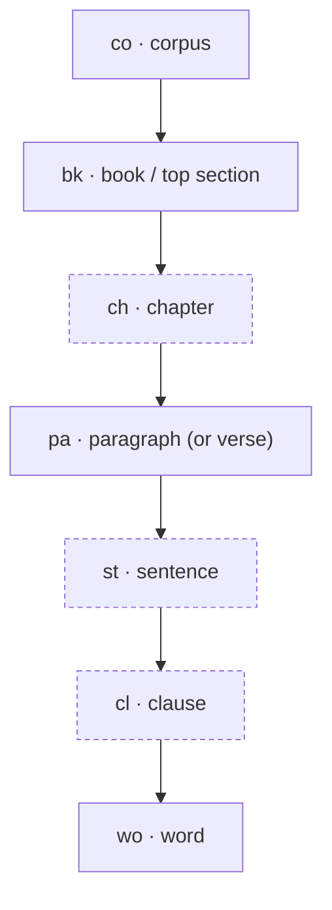
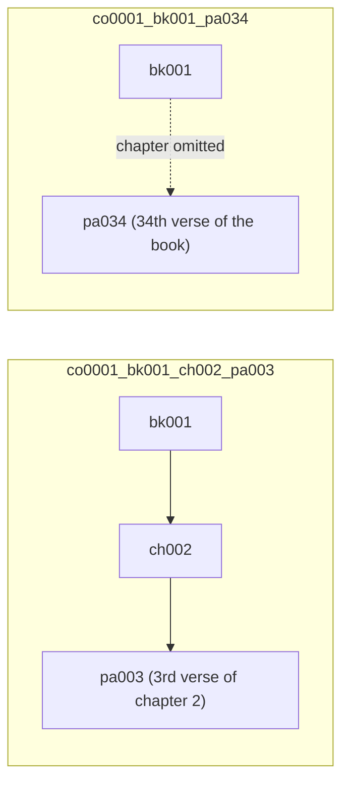
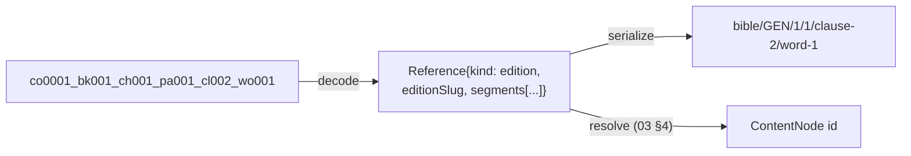

> **Status (2026-09-07).** This form is implemented in `common.utils.refcompact` as a *serialization* of a resolved node — it is emitted as `token` beside every reference and accepted by `/refs/resolve`, but it is **not** the citation string the UI shows or stores; that is the tfref short form (`bhsa@2021/Deut:4:2!clause1`). The amendments below (corpus slug instead of a hex id, prefixes bound by section depth, `pa` as a block unit on shallow corpora, `ph`, ranges, no version slot) are decided in [reference-forms.md](./reference-forms.md).

A compact, single-token address that names one node in one corpus, so a note, annotation or cross-reference in corpus A can point at a node in corpus B without carrying a URL or a UUID.

This is a **positional** address (ordinal walk down the tree). It complements, and does not replace, the scheme-based **canonical** addressing in [03 — References](./context-fabric/03-references.md) (`bible/JHN/3/16`), which resolves through codes and alias registries. See [Relationship to canonical references](#relationship-to-canonical-references).

## Example

```text
co0001_bk001_ch001_pa001_st001_cl001_wo001
```

## Grammar

```ebnf
reference = corpus , { "_" , level } ;
corpus    = "co" , id ;
level     = prefix , ordinal ;
prefix    = "bk" | "ch" | "pa" | "st" | "cl" | "wo" ;
ordinal   = digit , { digit } ;          (* 1-based, zero-padded to 3, may exceed 3 *)
id        = 4 * ( hex | digit ) ;
```

- Levels appear in the fixed order below, coarsest first. Any level may be omitted (see [Skipping levels](#skipping-levels)); the ones present keep their relative order.
- Ordinals are **1-based** and count siblings under the nearest *present* ancestor, in document order.
- Zero-padding to three digits is cosmetic. Parsers read the digits as an integer, so `pa1533` is legal.

## Levels



Dashed nodes are the levels most corpora do not have.

| Prefix | Level | Counts… | Canonical type it maps to | Present in today's converters? |
| --- | --- | --- | --- | --- |
| `co` | corpus | — (id, not ordinal) | `Edition` | yes (library filename today; see open issue 1) |
| `bk` | book / top-level section | sections under the root | `bible:book`, `quran:surah`, `generic:part` (category `division`) | yes |
| `ch` | chapter | chapters under the book | `bible:chapter`, `generic:chapter` | yes (`epub`, `tei div`) |
| `pa` | paragraph, or verse in scripture | blocks under the chapter | `generic:paragraph`, `bible:verse`, `quran:ayah` (category `block`) | yes |
| `st` | sentence | sentences under the paragraph | `ling:sentence` (category `inline`) | no (linguistic corpora such as BHSA only) |
| `cl` | clause | clauses under the sentence | `ling:clause` | no (BHSA only) |
| `wo` | word | words under the clause | `ling:word` | no (BHSA only) |

The type column comes from the alias registries in [02 — Node Taxonomy](./context-fabric/02-node-taxonomy.md) §4–5; the converter column from the same doc's §5 tables and the walker's `SectionSpec` in [_walker.py](../../packages/admin/src/admin/converters/_walker.py).

## Skipping levels

Every level after `co` is optional. When a level is omitted, the next present level counts **from the beginning of the nearest present ancestor**, flattening the skipped level(s).



Both references above can name the same verse (Genesis 1 has 31 verses, so verse 2:3 is the 34th verse of the book). Skipping is therefore a **view**, not a different node: resolution must return the same node id either way.

Rules:

1. A skipped level never changes which node is meant, only how it is counted.
2. A reference ending early (`co0001_bk001_ch002`) names the container node itself, not its first leaf.
3. Resolvers MUST accept the padded and unpadded forms (`pa003` = `pa3`).
4. A reference whose ordinal exceeds the sibling count resolves to `not_found`, never to an error (same rule as [03 — References §8](./context-fabric/03-references.md)).

## Relationship to canonical references

| Aspect | Inter-corpus reference (this doc) | Canonical Reference ([03](./context-fabric/03-references.md)) |
| --- | --- | --- |
| Scope | one specific corpus (`co` prefix) | a scheme, optionally pinned to a work/edition |
| Addressing | positional ordinals only | codes + canonical ordinals (`refOrdinal`), via alias registry |
| Survives re-conversion? | no: any structural change shifts ordinals | yes, as long as codes/`refOrdinal` are preserved |
| Survives versification differences? | no | yes, via edition alignment |
| Intended use | compact machine token in notes, annotations, URL fragments | human-entered and canonical citations |

Recommendation: store canonical references where one exists, and treat the compact form as a **serialization for a given corpus snapshot**. A resolver can translate between them once the target node is known, because every node carries `ordinal` (document position) alongside `code`/`refOrdinal`.

## Proposal: extend canonical References to the word

The canonical model already has everything needed to address sub-block nodes; it only lacked registered level types and a rule for where such addresses stop being edition-independent. Four changes, none of which touch `reference.schema.json`. **Applied 2026-09-06**: [02 §4.8](./context-fabric/02-node-taxonomy.md) registers `ling`, [03 §3.1](./context-fabric/03-references.md) appends the levels, and 03 §2 and §8 carry the token and failure rules. This section stays as the rationale.

### 1. Register a `ling` namespace in the taxonomy

Add to [02 — Node Taxonomy](./context-fabric/02-node-taxonomy.md) §3/§4 (a docs PR, not a schema change, per its registration rule 2):

| Canonical type | Category | Addressed by | Notes |
| --- | --- | --- | --- |
| `ling:sentence` | `inline` | `ordinal` | span inside the parent `block` |
| `ling:clause` | `inline` | `ordinal` | span inside a sentence |
| `ling:word` | `inline` | `ordinal` | one token; the finest addressable unit |

`inline` is the right category: the taxonomy defines it as a span inside a parent block's flow, and clients that do not know `ling:*` render it as plain text. Producers set `refOrdinal` to the 1-based position under the parent, as for any ordinal level.

### 2. Append optional sub-block levels to every scheme

Extend the level sequences in [03 — References](./context-fabric/03-references.md) §3 with the same three trailing levels, all optional:

| Scheme | Level sequence (existing → appended) |
| --- | --- |
| `bible` | … `bible:verse` → `ling:sentence` → `ling:clause` → `ling:word` |
| `quran` | … `quran:ayah` → `ling:sentence` → `ling:clause` → `ling:word` |
| `monograph`, `academic`, … | … `*:paragraph` → `ling:sentence` → `ling:clause` → `ling:word` |

An edition opts in by listing the levels it actually has in `structureProfile.levels`; an edition without them is unchanged, and `StructureLevel` needs no new field.

### 3. Serialize sub-block segments as `level-ordinal` tokens

Because the appended levels are optional and skippable, they always use rule 2 of §2.3 in [03](./context-fabric/03-references.md): `sentence-N`, `clause-N`, `word-N`. The fixed levels above them keep their existing token style, so every current canonical string stays valid.

```text
bible/GEN/1/1/word-3                  third word of the verse
bible/GEN/1/1/clause-2/word-1         first word of the second clause
bible/GEN/1/1/sentence-1/clause-2/word-1
monograph/chapter-4/paragraph-3/sentence-2
```

Skipping a level counts under the nearest present ancestor, exactly the [skip rule](#skipping-levels) of the compact form, so `word-3` and `clause-1/word-3` can name the same node and must resolve identically.

### 4. Sub-block references are `kind: edition`

Sentence, clause and word boundaries are a property of one analysis (the BHSA segmentation, a given translation's word order), not of the work. A Reference containing any `ling:*` segment therefore carries `kind: "edition"` and an `editionSlug`, and the resolver rejects a canonical one at parse time. Cross-edition word alignment, when wanted, uses the existing `aligned-with` edges of §7 rather than pretending word 3 is the same word in every translation.

### What stays the same

- **Ranges** (§6) expand in document order, so `bible/GEN/1/1/word-3` to `bible/GEN/1/2/word-1` works unchanged.
- **Failure modes** (§8): an edition without `ling:*` levels answers `partial` with the deepest matched ancestor, the verse.
- **The compact form** becomes a pure encoding of such a Reference: `co` ↔ `editionSlug`, and each prefix ↔ one `levelType` per scheme (`bk` ↔ `bible:book`, `pa` ↔ `bible:verse` or `generic:paragraph`, `st`/`cl`/`wo` ↔ `ling:*`). It needs no resolver of its own.



## Open issues

Items 1, 2, 4 and 5 are decided in [reference-forms.md](./reference-forms.md); the text below is kept as the original rationale.

1. **Corpus id collision.** *Decided: the library slug (`cobhsa`), `_` folded to `-`.* Four hex characters give 65,536 values; taking them from the tail of a UUID makes two corpora colliding a matter of luck, not policy. Prefer a registry-assigned short id (or the full corpus slug the library already uses as its filename) over a UUID suffix. Nothing in the pipeline assigns a corpus UUID today: the library keys corpora by `.corpus` filename and jobs by `job-<uuid>` (see [api.py](../../packages/admin/src/admin/services/api.py)).
2. **Prefix clash in the original draft.** `se` was used for both *section* and *sentence*. This draft uses `bk` for the top level and `st` for sentence; adjust if other prefixes read better.
3. **Three digits is not enough once levels are skipped.** Counting verses from the start of a long book exceeds 999 (TODO: cite a book/verse count source once ingested). Hence the rule that padding is cosmetic and ordinals are unbounded.
4. **`pa` is overloaded.** *Decided: `pa` is the 3rd section level when the corpus declares one, else the `paragraph`/`para`/`verse` node type under the innermost section.* Paragraph and verse are different node types in the taxonomy (`generic:paragraph` vs `bible:verse`) but share one prefix here. That is fine for a positional address as long as a corpus has exactly one `block`-category level under `ch`; corpora that have both (verse-per-paragraph editions) need a decision.
5. **Sub-paragraph levels exist only in linguistic corpora.** *Decided: `st`/`cl`/`ph`/`wo` are emitted only for node types the corpus actually has; `to_compact` refuses others and the API returns `token: null`.* None of the current converters emit them. The [proposal above](#proposal-extend-canonical-references-to-the-word) registers `ling:*` types so that editions which do have them (BHSA-style) can be addressed; the compact form must not claim `st`/`cl`/`wo` for an edition whose `structureProfile` lacks them.
